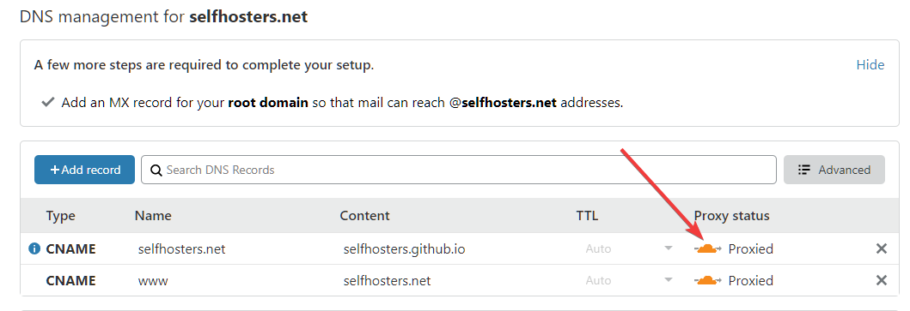
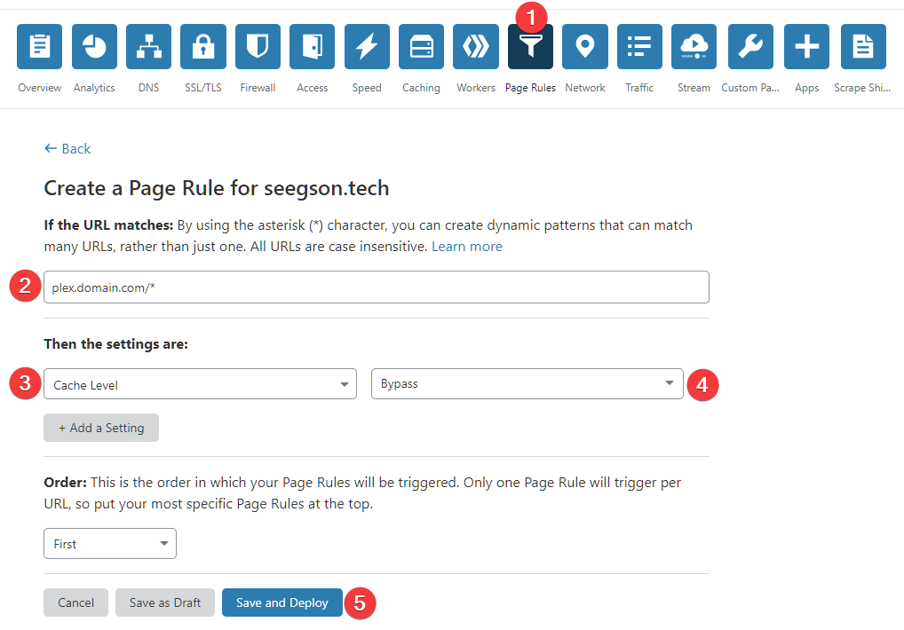
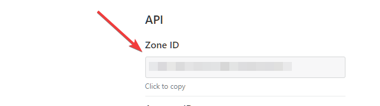
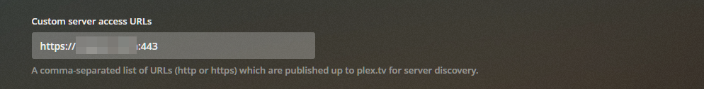
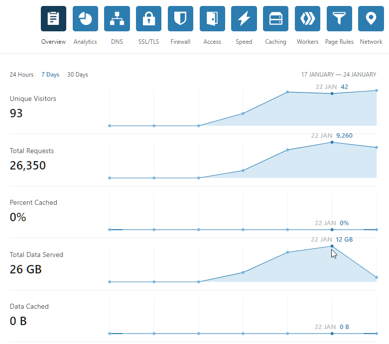

# Routing Plex through Cloudflare

## Why

Routing Plex through the [Cloudflare CDN](https://www.cloudflare.com/learning/cdn/what-is-a-cdn/) can vastly improve your remote connection speeds to your server. Cloudflare acts as a middle man between your server and your different clients.

Many experience bad peering between server and client even though the server has a good upload speed. This is because the client sometimes has to hop through all sorts of hoops if it's on a different ISP network. This can increase latency and lowered connection speeds.

But by using Cloudflare as a middle man, both your server and the clients will (in most cases) have a great connection to Cloudflare.

This will speed up the start times and scrolling of your streams and the general stability of the connection.

!!! Error "Update February 1, 2020"
    Cloudflare has updated their TOS with the following:

    !!! quote "Cloudflare TOS 2.8"
        Use of the Service for serving video (unless purchased separately as a Paid Service) or a disproportionate percentage of pictures, audio files, or other non-HTML content, is prohibited.
    It previously only mentioned cached content. So if you plan on doing this, I would recommend setting up a separate account and domain if you already use Cloudflare.

### Reverse proxy

To get this working you need to reverse proxy Plex. This guide won't go into detail on how to do this. But I highly recommend this guide as a starting point. [Let's Encrypt, Nginx & Reverse Proxy Starter Guide - 2019 Edition](https://blog.linuxserver.io/2019/04/25/letsencrypt-nginx-starter-guide/)

The [linuxserver/letsencrypt](https://hub.docker.com/r/linuxserver/letsencrypt/) container comes with premade nginx configs that you can use.
If you're stuck, just pop into the ==#reverse-proxy== channel on our [Discord](https://selfhosters.net/unraid) and someone will help you :slight_smile:

??? example "Nginx subdomain example"

    === "plex.conf"
        ```nginx
            server {
            listen 443 ssl;
            listen [::]:443 ssl;

            server_name plex.*;

            include /config/nginx/ssl.conf;

            client_max_body_size 0;
            proxy_redirect off;
            proxy_buffering off;

            location / {
                include /config/nginx/proxy.conf;
                proxy_pass http://HOSTIP:32400/;

                proxy_set_header Upgrade $http_upgrade;
                proxy_set_header Connection "upgrade";

                proxy_set_header X-Plex-Client-Identifier $http_x_plex_client_identifier;
                proxy_set_header X-Plex-Device $http_x_plex_device;
                proxy_set_header X-Plex-Device-Name $http_x_plex_device_name;
                proxy_set_header X-Plex-Platform $http_x_plex_platform;
                proxy_set_header X-Plex-Platform-Version $http_x_plex_platform_version;
                proxy_set_header X-Plex-Product $http_x_plex_product;
                proxy_set_header X-Plex-Token $http_x_plex_token;
                proxy_set_header X-Plex-Version $http_x_plex_version;
                proxy_set_header X-Plex-Nocache $http_x_plex_nocache;
                proxy_set_header X-Plex-Provides $http_x_plex_provides;
                proxy_set_header X-Plex-Device-Vendor $http_x_plex_device_vendor;
                proxy_set_header X-Plex-Model $http_x_plex_model;
            }
        }
        ```

    === "ssl.conf"
        ```nginx
        ## Version 2020/01/07 - Changelog: https://github.com/linuxserver/docker-letsencrypt/commits/master/root/defaults/ssl.conf

        # session settings
        ssl_session_timeout 1d;
        ssl_session_cache shared:SSL:50m;
        ssl_session_tickets off;

        # Diffie-Hellman parameter for DHE cipher suites
        ssl_dhparam /config/nginx/dhparams.pem;

        # ssl certs
        ssl_certificate /config/keys/letsencrypt/fullchain.pem;
        ssl_certificate_key /config/keys/letsencrypt/privkey.pem;

        # protocols
        # using generated 2020-01-07, https://ssl-config.mozilla.org/#server=nginx&server-version=1.16.1-r4&config=intermediate&openssl-version=1.1.1d-r3
        ssl_protocols TLSv1.2 TLSv1.3;
        ssl_ciphers ECDHE-ECDSA-AES128-GCM-SHA256:ECDHE-RSA-AES128-GCM-SHA256:ECDHE-ECDSA-AES256-GCM-SHA384:ECDHE-RSA-AES256-GCM-SHA384:ECDHE-ECDSA-CHACHA20-POLY1305:ECDHE-RSA-CHACHA20-POLY1305:DHE-RSA-AES128-GCM-SHA256:DHE-RSA-AES256-GCM-SHA384;
        ssl_prefer_server_ciphers off;

        # HSTS, remove # from the line below to enable HSTS
        #add_header Strict-Transport-Security "max-age=63072000; includeSubDomains; preload" always;

        # OCSP Stapling
        ssl_stapling on;
        ssl_stapling_verify on;
        resolver 127.0.0.11 valid=30s; # Docker DNS Server

        # Enable TLS 1.3 early data
        ssl_early_data on;

        # Optional additional headers
        #add_header Content-Security-Policy "upgrade-insecure-requests";
        #add_header X-Frame-Options "SAMEORIGIN" always;
        #add_header X-XSS-Protection "1; mode=block" always;
        #add_header X-Content-Type-Options "nosniff" always;
        #add_header X-UA-Compatible "IE=Edge" always;
        #add_header Cache-Control "no-transform" always;
        #add_header Referrer-Policy "same-origin" always;
        ```

    === "proxy.conf"
        ```nginx
        ## Version 2019/10/23 - Changelog: https://github.com/linuxserver/docker-letsencrypt/commits/master/root/defaults/proxy.conf

        client_body_buffer_size 128k;

        #Timeout if the real server is dead
        proxy_next_upstream error timeout invalid_header http_500 http_502 http_503;

        # Advanced Proxy Config
        send_timeout 5m;
        proxy_read_timeout 240;
        proxy_send_timeout 240;
        proxy_connect_timeout 240;

        # TLS 1.3 early data
        proxy_set_header Early-Data $ssl_early_data;

        # Basic Proxy Config
        proxy_set_header Host $host;
        proxy_set_header X-Real-IP $remote_addr;
        proxy_set_header X-Forwarded-For $proxy_add_x_forwarded_for;
        proxy_set_header X-Forwarded-Proto https;
        proxy_set_header X-Forwarded-Host $host;
        proxy_set_header X-Forwarded-Ssl on;
        proxy_redirect  http://  $scheme://;
        proxy_http_version 1.1;
        proxy_set_header Connection "";
        #proxy_cookie_path / "/; HTTPOnly; Secure"; # enable at your own risk, may break certain apps
        proxy_cache_bypass $cookie_session;
        proxy_no_cache $cookie_session;
        proxy_buffers 32 4k;
        proxy_headers_hash_bucket_size 128;
        proxy_headers_hash_max_size 1024;
        ```

### Cloudflare

If you haven't already you need to add your domain to Cloudflare for this to work. See this guide on how to do that: [Creating a Cloudflare account and adding a website](https://support.cloudflare.com/hc/en-us/articles/201720164-Creating-a-Cloudflare-account-and-adding-a-website)

In short you need to change your nameservers on your DNS provides page to the ones Cloudflare says.
This might take some time depending on the DNS provider. Last time I did it I was using Namecheap and it took less then 10 minutes to propagate, so have some patience.

After it's been transfered make sure the orange cloud is enabled. This is what activates the Cloudflare CDN on the domain.



#### Cache rules

This is very important that you do or else Cloudflare might ban your account for breaking the TOS on caching.

!!! info
    See: [2.8 Limitation on Serving Non-HTML Content](https://www.cloudflare.com/terms/)

Go to the ==Page Rules== menu and click on ==Create page rule==
You can have 3 page rules per domain.

Add your domain with a wildcard at the end like so: `plex.domain.com/*` If you're using your root domain you do the same. `domain.com/*` or `domain.com/plex*`

If you want to add the rule on all subdomains you can do that so: `*.domain.com/`

Next select the ==Cache Level== setting and set it to ==Bypass==
Then click ==Save and Deploy==



#### Disable IPv6

There is currently a [bug](https://forums.plex.tv/t/plex-api-sessions-status-not-honoring-x-forwarded-for-x-real-ip-with-ipv6-clients/175705) in Plex that it sees remote IPv6 adresses as local when reverse proxied. And as Cloudflare uses IPv6 we can disable that using the Cloudflare API. (It's not possible through the webUI)

This bug won't affect performance, but any remote streams using IPv6 will show as local on the Plex dashboard and in Tautili. So this is more of an annoyance that we can easily fix.

Below is the command you need to run for disabling IPv6.

```bash
    curl -X PATCH "https://api.cloudflare.com/client/v4/zones/xxxxxxxxxxxxxxxxx/settings/ipv6" \
    -H "X-Auth-Email: xxxxxxx@email.com" \
    -H "X-Auth-Key: xxxxxxxxxxxxxxxxxxxxx" \
    -H "Content-Type: application/json" \
    --data '{"value":"off"}'
```

In the API URL replace the x's with you Zone ID for you domain. You can find the zone ID on the ==Overview== page at the bottom.



On the second line add your email account you used for Cloudflare and on the third line add your ==Global API key==

The Global API key can be found on your profile page and then API Tokens.

Next just paste all the lines into the terminal and hit enter.

If successful, the output will look like this:

```json
    {"result":{"id":"ipv6","value":"off","modified_on":"2020-01-21T20:52:11.121560Z","editable":true},"success":true,"errors":[],"messages":[]}
```

In the webui it should now say that IPv6 Compatibility is off.


### Plex

#### Custom server access URLs

After you've setup your reverse proxy for Plex and configured Cloudflare, go into your Plex settings and select ==Network==.
Then click on ==Show Advanced== and scroll down to ==Custom server access URLs==

Add your domain you setup for plex with the port 443 after like so: `https://plexdomain.com:443` or `https://plexdomain.com:443/plex`and hit save.



At this point you do not need to have ==Remote Access== enabled anymore.

To test you can disable your ==Remote Access== and try and stream something remotely.

After a little while you should see on the Cloudflare ==Overview== page that the ==Total Data Served== have increased.



Happy streaming :smile:
