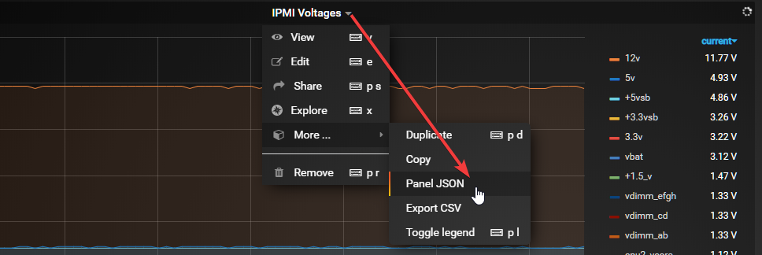

# Adding IPMI stats to the Telegraf container

## Telegraf

If we try and activate the ipmi_sensor plugin in the telegraf.conf file we will get an error in the log saying the following:

!!! error
    2020-01-21T17:28:50Z E! [inputs.ipmi_sensor] Error in plugin: ipmitool not found: verify that
    ipmitool is installed and that ipmitool is in your PATH

This happens because the telegraf container does not come with ipmitool installed.

This can be easly fixed by just adding the following command in the post argument when creating the container:

```bash
    /bin/sh -c 'apk update && apk add ipmitool && telegraf'
```

Edit the container and add the line in the ==Post Arguments:== input field.


Next just click save and the container will be recreated with impitool installed.

## Grafana

Below is two simple graph panels I made with Grafana.

Create two graph panels in Grafana and copy the JSON below.



??? Example "IPMI Voltages panel JSON"
    ```json
    {
    "datasource": null,
    "aliasColors": {},
    "bars": false,
    "cacheTimeout": null,
    "dashLength": 10,
    "dashes": false,
    "fill": 1,
    "fillGradient": 0,
    "gridPos": {
        "h": 8,
        "w": 16,
        "x": 0,
        "y": 0
    },
    "hiddenSeries": false,
    "id": 6,
    "legend": {
        "alignAsTable": true,
        "avg": false,
        "current": true,
        "max": false,
        "min": false,
        "rightSide": true,
        "show": true,
        "sort": "current",
        "sortDesc": true,
        "total": false,
        "values": true
    },
    "lines": true,
    "linewidth": 1,
    "links": [],
    "nullPointMode": "connected",
    "options": {
        "dataLinks": []
    },
    "percentage": false,
    "pluginVersion": "6.6.0-pre",
    "pointradius": 2,
    "points": false,
    "renderer": "flot",
    "seriesOverrides": [],
    "spaceLength": 10,
    "stack": false,
    "steppedLine": false,
    "targets": [
        {
        "alias": "$tag_name",
        "groupBy": [
            {
            "params": [
                "$__interval"
            ],
            "type": "time"
            },
            {
            "params": [
                "name"
            ],
            "type": "tag"
            },
            {
            "params": [
                "host"
            ],
            "type": "tag"
            },
            {
            "params": [
                "unit"
            ],
            "type": "tag"
            },
            {
            "params": [
                "none"
            ],
            "type": "fill"
            }
        ],
        "measurement": "ipmi_sensor",
        "orderByTime": "ASC",
        "policy": "default",
        "refId": "A",
        "resultFormat": "time_series",
        "select": [
            [
            {
                "params": [
                "value"
                ],
                "type": "field"
            },
            {
                "params": [],
                "type": "mean"
            }
            ]
        ],
        "tags": [
            {
            "key": "unit",
            "operator": "=",
            "value": "volts"
            }
        ]
        }
    ],
    "thresholds": [],
    "timeFrom": null,
    "timeRegions": [],
    "timeShift": null,
    "title": "IPMI Voltages",
    "tooltip": {
        "shared": true,
        "sort": 0,
        "value_type": "individual"
    },
    "type": "graph",
    "xaxis": {
        "buckets": null,
        "mode": "time",
        "name": null,
        "show": true,
        "values": []
    },
    "yaxes": [
        {
        "format": "volt",
        "label": null,
        "logBase": 1,
        "max": null,
        "min": null,
        "show": true
        },
        {
        "format": "short",
        "label": null,
        "logBase": 1,
        "max": null,
        "min": null,
        "show": true
        }
    ],
    "yaxis": {
        "align": false,
        "alignLevel": null
    }
    }
    ```

??? Example "IPMI Temperature panel JSON"
    ```json
    {
    "datasource": null,
    "aliasColors": {},
    "bars": false,
    "cacheTimeout": null,
    "dashLength": 10,
    "dashes": false,
    "fill": 1,
    "fillGradient": 0,
    "gridPos": {
        "h": 8,
        "w": 16,
        "x": 0,
        "y": 8
    },
    "hiddenSeries": false,
    "id": 8,
    "legend": {
        "alignAsTable": true,
        "avg": false,
        "current": true,
        "max": false,
        "min": false,
        "rightSide": true,
        "show": true,
        "sort": "current",
        "sortDesc": true,
        "total": false,
        "values": true
    },
    "lines": true,
    "linewidth": 1,
    "links": [],
    "nullPointMode": "connected",
    "options": {
        "dataLinks": []
    },
    "percentage": false,
    "pluginVersion": "6.6.0-pre",
    "pointradius": 2,
    "points": false,
    "renderer": "flot",
    "seriesOverrides": [],
    "spaceLength": 10,
    "stack": false,
    "steppedLine": false,
    "targets": [
        {
        "alias": "$tag_name",
        "groupBy": [
            {
            "params": [
                "$__interval"
            ],
            "type": "time"
            },
            {
            "params": [
                "name"
            ],
            "type": "tag"
            },
            {
            "params": [
                "host"
            ],
            "type": "tag"
            },
            {
            "params": [
                "unit"
            ],
            "type": "tag"
            },
            {
            "params": [
                "none"
            ],
            "type": "fill"
            }
        ],
        "measurement": "ipmi_sensor",
        "orderByTime": "ASC",
        "policy": "default",
        "refId": "A",
        "resultFormat": "time_series",
        "select": [
            [
            {
                "params": [
                "value"
                ],
                "type": "field"
            },
            {
                "params": [],
                "type": "mean"
            }
            ]
        ],
        "tags": [
            {
            "key": "unit",
            "operator": "=",
            "value": "degrees_c"
            }
        ]
        }
    ],
    "thresholds": [],
    "timeFrom": null,
    "timeRegions": [],
    "timeShift": null,
    "title": "IPMI Temperatures",
    "tooltip": {
        "shared": true,
        "sort": 0,
        "value_type": "individual"
    },
    "type": "graph",
    "xaxis": {
        "buckets": null,
        "mode": "time",
        "name": null,
        "show": true,
        "values": []
    },
    "yaxes": [
        {
        "format": "celsius",
        "label": "",
        "logBase": 1,
        "max": null,
        "min": null,
        "show": true
        },
        {
        "format": "short",
        "label": null,
        "logBase": 1,
        "max": null,
        "min": null,
        "show": true
        }
    ],
    "yaxis": {
        "align": false,
        "alignLevel": null
    }
    }
    ```

<iframe src="https://snapshot.raintank.io/dashboard-solo/snapshot/sh0G31Ev7DHxQJeMAhAItRtFArO2GKIy?orgId=2&from=1579632016305&to=1579632916305&panelId=4" width="800" height="400" frameborder="0"></iframe>

<iframe src="https://snapshot.raintank.io/dashboard-solo/snapshot/eYrngYsC3GZhC5N6Oyj1UaeiUKAhyg84?orgId=2&from=1579631832258&to=1579632732258&panelId=2" width="800" height="400" frameborder="0"></iframe>
