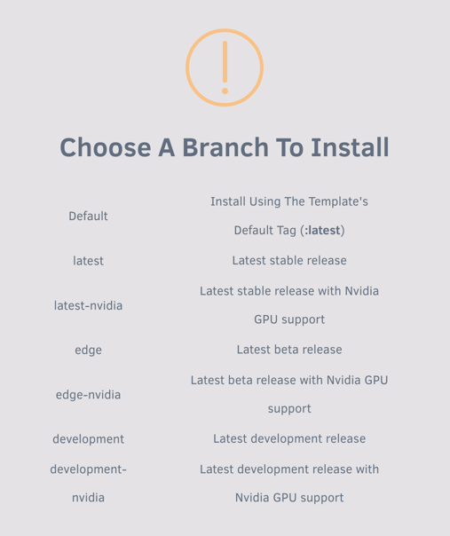
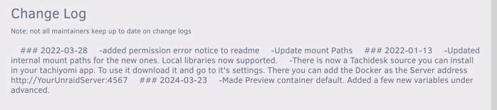
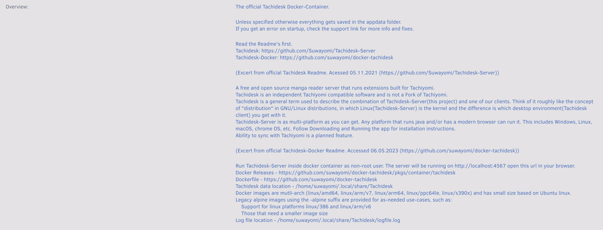
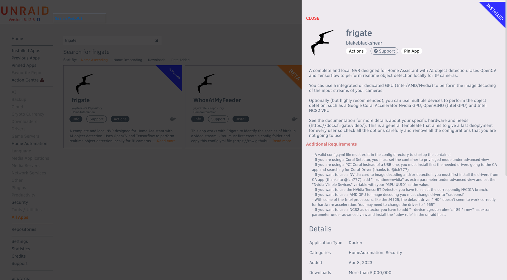
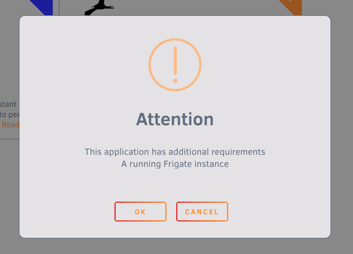
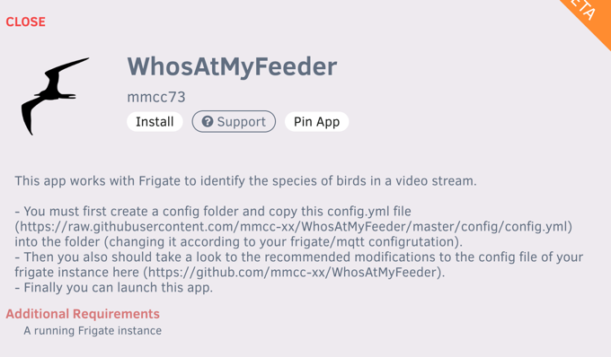
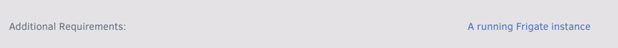
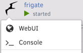

# Writing a template compatible for Unraid

This is an effort to collect information from [Squids FAQ](https://forums.unraid.net/topic/57181-docker-faq/){target=_
blank}.

## Prerequisites

### Enabling Template Authoring Mode

In order to have a smooth experience creating templates I highly recommend enabling `Template Authoring Mode`, it allows
you to see the XML in clear-text and some other small neat tricks we might need to come back to.

This process requires you to shut down the docker service for a short while, as Unraid doesn't let us change the setting
with the service running.


When the docker service is successfully shut down, enable advanced view.


We can now enable authoring mode, you can also toggle the docker service back on.


## Auto-generating from Docker image

### 1. Search from Docker Hub

??? note "Make sure you can retrieve search results from Docker Hub"

    In order to have Community Applications generate a template, we need to enable additional search from Docker Hub. You do this by opening CA, and press the settings button on the sidebar, and enabling additional search.
    
    

For this guide I will use `domistyle/idrac6` as an example. Go back to CA, and type the image you want to create a
template for in the search bar (If you get a match now, chances are, it is already in CA) and
press `Get More Results From Docker Hub`.


Community Applications shows results for both the image-maintainer, and image-name. Which means that we will get similar
results. Press the download to disk icon, and let Community Applications convert it.


For this one Community Applications didn't do a very good job in converting it (It reads the Dockerfile for volumes,
expose, publish etc.), however we can modify it with the template editor in Unraid.


### 2. Edit the template

To see what we need to edit, we can most often refer to
the [readme](https://github.com/DomiStyle/docker-idrac6/blob/master/README.md#usage) of the container

(Including a screenshot in case the readme changes)
.

!!! note "Get to know the template editor, its very handy. Also for managing existing templates."

I'm going through the rest of this guide with a mix of views (to remove clutter from images). If some of the settings
you see in a screenshot isn't showing to you, enable advanced view.


#### Variables

I will start with adding the variables, just because those are on the top of the documentation of this container.

To add the `IDRAC_HOST` variable, we are going to press the `Add another Path, Port, Variable or Device` link.


We need to change the Config Type to Variable, then we can start adding values. There is a lot going on here, but it is
all going to make sense in the end.

- `Name` - The name for the variable, this is to help the user identifying what this variable does.

- `Key` - This is the actual variable, so we are putting `IDRAC_HOST` here.

- `Value` - We don't fill this, this is for the user.

- `Default Value` - We could fill this, but since we can only do an estimated guess on what a users idrac host is, we
  are going to skip it.

- `Description` - Usually I don't fill this field with this long of a text, but the documentation of the container had a
  good one, so I'm using it.

- `Display` - This decides if the "average user" (someone that isn't using advanced view) is going to see this variable.

- `Required` - I set this to yes because I know the container wont work without it set. The fact that the documentation
  tells me its required also helped in the decision.

- `Password Mask` - This isn't a password, so it doesn't need to have its value masked behind asterisk (*).


??? example "Here are some screenshots on how I added the other required variables"

    
    Here I set the Default value as root, since I know that's the default username on idrac

    
    Here I set the Default value as calvin, since I know that's the default password on idrac, I also enabled Password Mask

#### Volumes

Next is adding the volumes. We press the same `Add another Path, Port, Variable or Device` link, but we don't need to
change the config type this time.
The fields we can add here is mostly the same, but with the "Volume" type some of them are voided. Like password mask.

If it's a "proper" appdata location, I set required to yes

- `Access Mode` - Defines how the container should have access to this volume. Almost always `read/write`


#### Ports

Now it is time for the ports. We press the same `Add another Path, Port, Variable or Device` link. This time we need to
change the config type to `Port`.

The documentation for this container says we can use port 5800 to access the interface, so that's the port we are going
to add. It also mentions the VNC port, but most users wont need this.

- `Connection Type` - Always `TCP`, unless specified otherwise.


#### Metadata

Now you have a basic template. This might be enough for your own usage, but in order to add it to Community Applications
we should add some spice to the template.

As you can see there are lots of fields we can fill in with the template editor.


I'm not going to walk you through this, but I am going to tell you how it ended up like it did.

I changed the overview to match the intro from the readme of the container.

I used the dropdown to set the categories as I saw fit.

I set the support thread as the issue page of the project.

!!! danger "Do not do this if you are creating a template for your own container, create a support thread on the Unraid
forums and use that link"

The project page is usually the GitHub link to the container.

I have yet to change the Icon URL, because I need to create an icon.

`WebUI` Should be filled with the *container* port, Unraid should do the translation `http://[IP]:[PORT:5800]`. If this
is an https enabled port, set the url to use https.

For Post arguments and Extra Parameters, you should know if you need to fill this.

!!! note "There is more information on this in the [Manual way](#2-fill-the-base) part"


### 3. Grab the XML

Once you have filled all the fields, and set the ports, variables and volumes as good as you can, you can press
the `Save` button, this takes you to a page where can see the xml in plain-text. Don't worry, it also saves the xml to
your OS disk. Bellow is the XML generated by the procedure above.

??? example "Extracted XML"

    ```xml
    <?xml version="1.0"?>
    <Container version="2">
        <Name>idrac6</Name>
        <Repository>domistyle/idrac6</Repository>
        <Registry>https://hub.docker.com/r/domistyle/idrac6/</Registry>
        <Network>bridge</Network>
        <MyIP/>
        <Shell>sh</Shell>
        <Privileged>false</Privileged>
        <Support>https://github.com/DomiStyle/docker-idrac6/issues</Support>
        <Project>https://github.com/DomiStyle/docker-idrac6/</Project>
        <Overview>Allows access to the iDRAC 6 console without installing Java or messing with Java Web Start. Java is only run inside of the container and access is provided via web interface or directly with VNC.</Overview>
        <Category>Tools: Network:Management</Category>
        <WebUI>http://[IP]:[PORT:5800]</WebUI>
        <TemplateURL/>
        <Icon>/plugins/dynamix.docker.manager/images/question.png</Icon>
        <ExtraParams/>
        <PostArgs/>
        <CPUset/>
        <DateInstalled>1579532295</DateInstalled>
        <DonateText/>
        <DonateLink/>
        <Description>Allows access to the iDRAC 6 console without installing Java or messing with Java Web Start. Java is only run inside of the container and access is provided via web interface or directly with VNC.</Description>
        <Networking>
            <Mode>bridge</Mode>
            <Publish>
            <Port>
                <HostPort/>
                <ContainerPort>5800</ContainerPort>
                <Protocol>tcp</Protocol>
            </Port>
            </Publish>
        </Networking>
        <Data>
            <Volume>
            <HostDir/>
            <ContainerDir>/vmedia</ContainerDir>
            <Mode>rw</Mode>
            </Volume>
            <Volume>
            <HostDir/>
            <ContainerDir>/app</ContainerDir>
            <Mode>rw</Mode>
            </Volume>
            <Volume>
            <HostDir/>
            <ContainerDir>/screenshots</ContainerDir>
            <Mode>rw</Mode>
            </Volume>
        </Data>
        <Environment>
            <Variable>
            <Value/>
            <Name>IDRAC_HOST</Name>
            <Mode/>
            </Variable>
            <Variable>
            <Value/>
            <Name>IDRAC_USER</Name>
            <Mode/>
            </Variable>
            <Variable>
            <Value/>
            <Name>IDRAC_PASSWORD</Name>
            <Mode/>
            </Variable>
            <Variable>
            <Value/>
            <Name>IDRAC_PORT</Name>
            <Mode/>
            </Variable>
            <Variable>
            <Value>false</Value>
            <Name>IDRAC_KEYCODE_HACK</Name>
            <Mode/>
            </Variable>
            <Variable>
            <Value>99</Value>
            <Name>USER_ID</Name>
            <Mode/>
            </Variable>
            <Variable>
            <Value>100</Value>
            <Name>GROUP_ID</Name>
            <Mode/>
            </Variable>
        </Environment>
        <Labels/>
        <Config Name="idrac host" Target="IDRAC_HOST" Default="" Mode="" Description="Host for your iDRAC instance. Make sure your instance is reachable with https://&amp;lt;IDRAC_HOST&amp;gt;. See IDRAC_PORT for using custom ports. HTTPS is always used." Type="Variable" Display="always" Required="true" Mask="false"/>
        <Config Name="idrac user" Target="IDRAC_USER" Default="root" Mode="" Description="Username for your iDRAC instance." Type="Variable" Display="always" Required="true" Mask="false"/>
        <Config Name="idrac password" Target="IDRAC_PASSWORD" Default="calvin" Mode="" Description="Password for your iDRAC instance." Type="Variable" Display="always" Required="true" Mask="true"/>
        <Config Name="WebUI" Target="5800" Default="5800" Mode="tcp" Description="web interface port" Type="Port" Display="always" Required="true" Mask="false"/>
        <Config Name="idrac port" Target="IDRAC_PORT&#9;" Default="443" Mode="" Description="The optional port for the web interface." Type="Variable" Display="advanced-hide" Required="false" Mask="false"/>
        <Config Name="keyboard fix" Target="IDRAC_KEYCODE_HACK" Default="false|true" Mode="" Description="If you have issues with keyboard input, try setting this to true." Type="Variable" Display="advanced-hide" Required="false" Mask="false">false</Config>
        <Config Name="PUID" Target="USER_ID" Default="" Mode="" Description="PUID" Type="Variable" Display="advanced" Required="false" Mask="false">99</Config>
        <Config Name="PGID" Target="GROUP_ID" Default="" Mode="" Description="PGID" Type="Variable" Display="advanced" Required="false" Mask="false">100</Config>
        <Config Name="Virtual media" Target="/vmedia" Default="/mnt/user/appdata/idrac/vmedia" Mode="rw" Description="Can be used to allow virtual media to be mounted." Type="Path" Display="advanced" Required="false" Mask="false"/>
        <Config Name="Libraries" Target="/app" Default="/mnt/user/appdata/idrac/app" Mode="rw" Description="Libraries downloaded from your iDRAC instance will be stored here. Add a volume to cache those files for a faster container startup." Type="Path" Display="advanced" Required="false" Mask="false"/>
        <Config Name="Screenshots" Target="/screenshots" Default="/mnt/user/appdata/idrac/screenshots" Mode="rw" Description="Container Path: /screenshots" Type="Path" Display="advanced" Required="false" Mask="false"/>
    </Container>
    ```

### 4. Clean the XML

Community Applications adds a lot of stuff that is not necessary for a template, but which Unraid uses to actually run
and present the container.

My first steps in removing unnecessary tags is to delete tags that are closed without value, like `<MyIP/>`.

??? example "XML after"

    ```xml
    <?xml version="1.0"?>
    <Container version="2">
        <Name>idrac6</Name>
        <Repository>domistyle/idrac6</Repository>
        <Registry>https://hub.docker.com/r/domistyle/idrac6/</Registry>
        <Network>bridge</Network>
        <Shell>sh</Shell>
        <Privileged>false</Privileged>
        <Support>https://github.com/DomiStyle/docker-idrac6/issues</Support>
        <Project>https://github.com/DomiStyle/docker-idrac6/</Project>
        <Overview>Allows access to the iDRAC 6 console without installing Java or messing with Java Web Start. Java is only run inside of the container and access is provided via web interface or directly with VNC.</Overview>
        <Category>Tools: Network:Management</Category>
        <WebUI>http://[IP]:[PORT:5800]</WebUI>
        <Icon>/plugins/dynamix.docker.manager/images/question.png</Icon>
        <DateInstalled>1579532295</DateInstalled>
        <Description>Allows access to the iDRAC 6 console without installing Java or messing with Java Web Start. Java is only run inside of the container and access is provided via web interface or directly with VNC.</Description>
        <Networking>
            <Mode>bridge</Mode>
            <Publish>
            <Port>
                <HostPort/>
                <ContainerPort>5800</ContainerPort>
                <Protocol>tcp</Protocol>
            </Port>
            </Publish>
        </Networking>
        <Data>
            <Volume>
            <HostDir/>
            <ContainerDir>/vmedia</ContainerDir>
            <Mode>rw</Mode>
            </Volume>
            <Volume>
            <HostDir/>
            <ContainerDir>/app</ContainerDir>
            <Mode>rw</Mode>
            </Volume>
            <Volume>
            <HostDir/>
            <ContainerDir>/screenshots</ContainerDir>
            <Mode>rw</Mode>
            </Volume>
        </Data>
        <Environment>
            <Variable>
            <Value/>
            <Name>IDRAC_HOST</Name>
            <Mode/>
            </Variable>
            <Variable>
            <Value/>
            <Name>IDRAC_USER</Name>
            <Mode/>
            </Variable>
            <Variable>
            <Value/>
            <Name>IDRAC_PASSWORD</Name>
            <Mode/>
            </Variable>
            <Variable>
            <Value/>
            <Name>IDRAC_PORT</Name>
            <Mode/>
            </Variable>
            <Variable>
            <Value>false</Value>
            <Name>IDRAC_KEYCODE_HACK</Name>
            <Mode/>
            </Variable>
            <Variable>
            <Value>99</Value>
            <Name>USER_ID</Name>
            <Mode/>
            </Variable>
            <Variable>
            <Value>100</Value>
            <Name>GROUP_ID</Name>
            <Mode/>
            </Variable>
        </Environment>
        <Config Name="idrac host" Target="IDRAC_HOST" Default="" Mode="" Description="Host for your iDRAC instance. Make sure your instance is reachable with https://&amp;lt;IDRAC_HOST&amp;gt;. See IDRAC_PORT for using custom ports. HTTPS is always used." Type="Variable" Display="always" Required="true" Mask="false"/>
        <Config Name="idrac user" Target="IDRAC_USER" Default="root" Mode="" Description="Username for your iDRAC instance." Type="Variable" Display="always" Required="true" Mask="false"/>
        <Config Name="idrac password" Target="IDRAC_PASSWORD" Default="calvin" Mode="" Description="Password for your iDRAC instance." Type="Variable" Display="always" Required="true" Mask="true"/>
        <Config Name="WebUI" Target="5800" Default="5800" Mode="tcp" Description="web interface port" Type="Port" Display="always" Required="true" Mask="false"/>
        <Config Name="idrac port" Target="IDRAC_PORT&#9;" Default="443" Mode="" Description="The optional port for the web interface." Type="Variable" Display="advanced-hide" Required="false" Mask="false"/>
        <Config Name="keyboard fix" Target="IDRAC_KEYCODE_HACK" Default="false|true" Mode="" Description="If you have issues with keyboard input, try setting this to true." Type="Variable" Display="advanced-hide" Required="false" Mask="false">false</Config>
        <Config Name="PUID" Target="USER_ID" Default="" Mode="" Description="PUID" Type="Variable" Display="advanced" Required="false" Mask="false">99</Config>
        <Config Name="PGID" Target="GROUP_ID" Default="" Mode="" Description="PGID" Type="Variable" Display="advanced" Required="false" Mask="false">100</Config>
        <Config Name="Virtual media" Target="/vmedia" Default="/mnt/user/appdata/idrac/vmedia" Mode="rw" Description="Can be used to allow virtual media to be mounted." Type="Path" Display="advanced" Required="false" Mask="false"/>
        <Config Name="Libraries" Target="/app" Default="/mnt/user/appdata/idrac/app" Mode="rw" Description="Libraries downloaded from your iDRAC instance will be stored here. Add a volume to cache those files for a faster container startup." Type="Path" Display="advanced" Required="false" Mask="false"/>
        <Config Name="Screenshots" Target="/screenshots" Default="/mnt/user/appdata/idrac/screenshots" Mode="rw" Description="Container Path: /screenshots" Type="Path" Display="advanced" Required="false" Mask="false"/>
    </Container>
    ```

Since I prefer using just the `Config` tags, I also remove the tags `Networking`, `Data` and `Environment` together with
it's content.

??? example "XML after"

    ```xml
    <?xml version="1.0"?>
    <Container version="2">
        <Name>idrac6</Name>
        <Repository>domistyle/idrac6</Repository>
        <Registry>https://hub.docker.com/r/domistyle/idrac6/</Registry>
        <Network>bridge</Network>
        <Shell>sh</Shell>
        <Privileged>false</Privileged>
        <Support>https://github.com/DomiStyle/docker-idrac6/issues</Support>
        <Project>https://github.com/DomiStyle/docker-idrac6/</Project>
        <Overview>Allows access to the iDRAC 6 console without installing Java or messing with Java Web Start. Java is only run inside of the container and access is provided via web interface or directly with VNC.</Overview>
        <Category>Tools: Network:Management</Category>
        <WebUI>http://[IP]:[PORT:5800]</WebUI>
        <Icon>/plugins/dynamix.docker.manager/images/question.png</Icon>
        <DateInstalled>1579532295</DateInstalled>
        <Description>Allows access to the iDRAC 6 console without installing Java or messing with Java Web Start. Java is only run inside of the container and access is provided via web interface or directly with VNC.</Description>
        <Config Name="idrac host" Target="IDRAC_HOST" Default="" Mode="" Description="Host for your iDRAC instance. Make sure your instance is reachable with https://&amp;lt;IDRAC_HOST&amp;gt;. See IDRAC_PORT for using custom ports. HTTPS is always used." Type="Variable" Display="always" Required="true" Mask="false"/>
        <Config Name="idrac user" Target="IDRAC_USER" Default="root" Mode="" Description="Username for your iDRAC instance." Type="Variable" Display="always" Required="true" Mask="false"/>
        <Config Name="idrac password" Target="IDRAC_PASSWORD" Default="calvin" Mode="" Description="Password for your iDRAC instance." Type="Variable" Display="always" Required="true" Mask="true"/>
        <Config Name="WebUI" Target="5800" Default="5800" Mode="tcp" Description="web interface port" Type="Port" Display="always" Required="true" Mask="false"/>
        <Config Name="idrac port" Target="IDRAC_PORT&#9;" Default="443" Mode="" Description="The optional port for the web interface." Type="Variable" Display="advanced-hide" Required="false" Mask="false"/>
        <Config Name="keyboard fix" Target="IDRAC_KEYCODE_HACK" Default="false|true" Mode="" Description="If you have issues with keyboard input, try setting this to true." Type="Variable" Display="advanced-hide" Required="false" Mask="false">false</Config>
        <Config Name="PUID" Target="USER_ID" Default="" Mode="" Description="PUID" Type="Variable" Display="advanced" Required="false" Mask="false">99</Config>
        <Config Name="PGID" Target="GROUP_ID" Default="" Mode="" Description="PGID" Type="Variable" Display="advanced" Required="false" Mask="false">100</Config>
        <Config Name="Virtual media" Target="/vmedia" Default="/mnt/user/appdata/idrac/vmedia" Mode="rw" Description="Can be used to allow virtual media to be mounted." Type="Path" Display="advanced" Required="false" Mask="false"/>
        <Config Name="Libraries" Target="/app" Default="/mnt/user/appdata/idrac/app" Mode="rw" Description="Libraries downloaded from your iDRAC instance will be stored here. Add a volume to cache those files for a faster container startup." Type="Path" Display="advanced" Required="false" Mask="false"/>
        <Config Name="Screenshots" Target="/screenshots" Default="/mnt/user/appdata/idrac/screenshots" Mode="rw" Description="Container Path: /screenshots" Type="Path" Display="advanced" Required="false" Mask="false"/>
    </Container>
    ```

Remove `DateInstalled`, since it's just used internally for Unraid.

Unless you know what shell the container uses, also remove `Shell`.

??? example "What I consider a good XML, to base a PR on"

    ```xml
    <?xml version="1.0"?>
    <Container version="2">
        <Name>idrac6</Name>
        <Repository>domistyle/idrac6</Repository>
        <Registry>https://hub.docker.com/r/domistyle/idrac6/</Registry>
        <Network>bridge</Network>
        <Privileged>false</Privileged>
        <Support>https://github.com/DomiStyle/docker-idrac6/issues</Support>
        <Project>https://github.com/DomiStyle/docker-idrac6/</Project>
        <Overview>Allows access to the iDRAC 6 console without installing Java or messing with Java Web Start. Java is only run inside of the container and access is provided via web interface or directly with VNC.</Overview>
        <Category>Tools: Network:Management</Category>
        <WebUI>http://[IP]:[PORT:5800]</WebUI>
        <Icon>/plugins/dynamix.docker.manager/images/question.png</Icon>
        <Description>Allows access to the iDRAC 6 console without installing Java or messing with Java Web Start. Java is only run inside of the container and access is provided via web interface or directly with VNC.</Description>
        <Config Name="idrac host" Target="IDRAC_HOST" Default="" Mode="" Description="Host for your iDRAC instance. Make sure your instance is reachable with https://&amp;lt;IDRAC_HOST&amp;gt;. See IDRAC_PORT for using custom ports. HTTPS is always used." Type="Variable" Display="always" Required="true" Mask="false"/>
        <Config Name="idrac user" Target="IDRAC_USER" Default="root" Mode="" Description="Username for your iDRAC instance." Type="Variable" Display="always" Required="true" Mask="false"/>
        <Config Name="idrac password" Target="IDRAC_PASSWORD" Default="calvin" Mode="" Description="Password for your iDRAC instance." Type="Variable" Display="always" Required="true" Mask="true"/>
        <Config Name="WebUI" Target="5800" Default="5800" Mode="tcp" Description="web interface port" Type="Port" Display="always" Required="true" Mask="false"/>
        <Config Name="idrac port" Target="IDRAC_PORT&#9;" Default="443" Mode="" Description="The optional port for the web interface." Type="Variable" Display="advanced-hide" Required="false" Mask="false"/>
        <Config Name="keyboard fix" Target="IDRAC_KEYCODE_HACK" Default="false|true" Mode="" Description="If you have issues with keyboard input, try setting this to true." Type="Variable" Display="advanced-hide" Required="false" Mask="false">false</Config>
        <Config Name="PUID" Target="USER_ID" Default="" Mode="" Description="PUID" Type="Variable" Display="advanced" Required="false" Mask="false">99</Config>
        <Config Name="PGID" Target="GROUP_ID" Default="" Mode="" Description="PGID" Type="Variable" Display="advanced" Required="false" Mask="false">100</Config>
        <Config Name="Virtual media" Target="/vmedia" Default="/mnt/user/appdata/idrac/vmedia" Mode="rw" Description="Can be used to allow virtual media to be mounted." Type="Path" Display="advanced" Required="false" Mask="false"/>
        <Config Name="Libraries" Target="/app" Default="/mnt/user/appdata/idrac/app" Mode="rw" Description="Libraries downloaded from your iDRAC instance will be stored here. Add a volume to cache those files for a faster container startup." Type="Path" Display="advanced" Required="false" Mask="false"/>
        <Config Name="Screenshots" Target="/screenshots" Default="/mnt/user/appdata/idrac/screenshots" Mode="rw" Description="Container Path: /screenshots" Type="Path" Display="advanced" Required="false" Mask="false"/>
    </Container>
    ```

!!! note "More spice"
    It's worth reading [Add a Config Entry](#3-add-a-config-entry) and [XML Field Explanations](#xml-field-explanations) to
    see if any of that applies to your template.

## Manually writing a template

### 1. Starting from "scratch"

To make sure we don't miss anything, we are going to start from a baseXML.

I'm using the same [example-container](https://hub.docker.com/r/domistyle/idrac6/){target=_blank} as above.

!!! note "Knowing the basics of [XML](https://www.w3schools.com/xml/default.asp){target=_blank} is preferred"

??? example "baseXML"

    ```xml
    <?xml version="1.0"?>
        <Container version="2">
        <Name></Name>
        <Repository></Repository>
        <Registry></Registry>
        <Network>bridge</Network>
        <Privileged>false</Privileged>
        <Support></Support>
        <Project></Project>
        <Overview></Overview>
        <WebUI></WebUI>
        <TemplateURL/>
        <Icon>/plugins/dynamix.docker.manager/images/question.png</Icon>
        <ExtraParams/>
        <PostArgs/>
        <DonateText/>
        <DonateLink/>
    </Container>
    ```

### 2. Fill the base

Since you are here browsing the "hard" way, I'm assuming you know some, if not most of the Docker terminology used going
forward.

Filling the baseXML above is pretty straight forward, however the tags expect the following:

- `Name` - The name for the container, preferably in lowercase.

- `Repository` - The name of the image to pull from Docker Hub (other repositories work). e.g. `domistyle/idrac6`

- `Registry` - Link to the Docker Hub page for this container. e.g. `https://hub.docker.com/r/domistyle/idrac6/`

- `Support` - A link to a support thread on the Unraid forums for the container

- `Project` - Link to the GitHub page (or the homepage of the project)
  e.g. `https://github.com/DomiStyle/docker-idrac6/`

- `Overview` - Basic description of the project. e.g.
  > Allows access to the iDRAC 6 console without installing Java or messing with Java Web Start. Java is only run inside
  of the container and access is provided via web interface or directly with VNC.

- `WebUI` - Which container-port a web UI might be on. e.g. `http://[IP]:[PORT:5800]` Unraid will translate this string
  to the IP of the server, and the host-port set for container-port 5800

- `Icon` URL to an icon, personally I prefer them in png. It has to be loaded over https.
  e.g. `https://raw.githubusercontent.com/selfhosters/unRAID-CA-templates/master/templates/img/chevereto.png`
  {:
  style="height:1em"}

- `ExtraParams` - Parameters sent with the `docker run` command. e.g. `--restart unless-stopped`

- `PostArgs` - Command to run inside the container after start.
  e.g. `/bin/sh -c 'apk update && apk add ipmitool && telegraf'`
  [See valid example](../../telegraf/ipmi#telegraf){target=_blank}

- `DonateText` - Text to show with the donate button.

- `DonateLink` - URL for donations.

- `Network` - Usually `bridge` if not specified by the image maintainer

- `TemplateURL` - URL to the template. If it is a PR to our repo, set it
  to `https://raw.githubusercontent.com/selfhosters/unRAID-CA-templates/master/templates/<container-name>.xml` and
  replace `<container-name>` with the actual name of the container (again, in lowercase).

!!! warning
    Has to be a raw link for GitHub.

- `DonateImg` URL to donation image.

### 3. Add a Config entry

There are two ways to achieve this, but I'm only going to focus on one of them.
The syntax is like this:

```xml

<Config Name="" Target="" Default="" Mode="rw" Description="" Type="Path" Display="always" Required="false"
        Mask="false"/>
```

This syntax spans over all the 4 config types, some attributes changes meaning depending on the `Type`.

#### Add a Volume

The volume specific values are:

- `Target` - The container path for the volume. e.g. `/config`

- `Mode` - What permissions to use for the volume.
    - `rw` as ReadWrite
    - `ro` as ReadOnly
    - Slave options are also supported

- `Type` - Always `Path`.

#### Add a Variable

- `Target` - The variable. e.g. `IDRAC_HOST`

- `Type` - Always `Variable`.

#### Add a Port

- `Target` - The container port. e.g. `80`

- `Type` - Always `Port`.

#### Shared attributes

- `Name` - The name that shows in the Unraid template manager. e.g. `Appdata`, `PUID`, `WebUI`

- `Description` - A more detailed description on this Config. e.g `Appdata location`, `PUID`, `WebUI`

- `Default` - Suggested value for the Config. e.g. `/mnt/user/appdata/idrac`, `99`, `8080`

- `Display` - How the volume is shown to the user.
    - `always` Always show the volume, can be edited and deleted in basic view.
    - `always-hide`  Always show the volume, *cannot* be edited and deleted in basic view.
    - `advanced` Shows when the user presses `Show more settings ...`, can be edited and deleted in basic view.
    - `advanced-hide` Shows when the user presses `Show more settings ...`, *cannot* be edited and deleted in basic
      view.

- `Required` If the user is able to continue without specifying the value. `true` or `false`

- `Mask` If the value should be masked behind asterisks, only really useful on variables. `true` or `false`

## Tips and Tricks

### Limit Config entry to predefined values

For a Config field, instead of allowing users to type in a value, you can provide a dropdown list of options. In
the `Default` attribute, list the available values separated by the pipe (`|`) character (e.g. `Default="true|false"`).
This is *highly recommended* for boolean values.

### Categorization tool

It's preferred to categorize your template, and recommended to use the "Application Categorizer" plugin to generate the
appropriate tags.


## XML field explanations

This is an alphabetical, non-exhaustive list of the fields that can be provided in the `<Container>` section of the XML
template (as of Unraid 6.10+), and what they do. For a full list, see
the [XML schema post](https://forums.unraid.net/topic/38619-docker-template-xml-schema/){target=_blank}.

Please note that a number of these fields are optional, and you should only include them if they are relevant to your
container.

- `Banner` - A URL to a banner image for the container. This should be a direct link to an image file, typically a PNG
  file.

- `Beta` - Gives the application a warning in Community Applications with the following
  text `This application has been marked as being Beta. This does NOT neccessarily mean that there will be issues.`. Set
  to either `true` or `false`.

- `Branch` - Offer different versions of the container to the user. This corresponds to different tags on the Docker
  image. For example, offer a `latest` branch and a `beta` branch, or a version of the container that uses different GPU
  drivers.

    ??? info "Screenshot"

        

- `Tag` - The tag of the Docker image to use. It is typical to include at least a `latest` tag, but other tags can be
  used as well.

- `TagDescription` - A description of the tag. This is displayed to the user when they are installing the container.

- `Category` - A list of categories that this template belongs to. Please use
  the ["Application Categorizer" plugin](#categorization-tool) to generate the appropriate tags. Proper categories make
  your template more discoverable in the Community Applications store.

- `Changes` - A changelog for the template. This should be used for changes to the template, *NOT* changes to the
  application itself. This is displayed in the Community Applications store entry.
  This [only supports Markdown](https://forums.unraid.net/topic/38431-plug-in-application-template-categorizer/page/2/#comment-375520),
  not HTML.

    ??? info "Screenshot"

        

- `Config` - A configuration entry for the container. See the [Add a Config](#3-add-a-config-entry) section for more
  information.

- `Date` - The date this container was last updated. This is used internally by Unraid and should not be modified. Do
  *NOT* include this in your template.

- `DateInstalled` - The date that the container was installed. This is used internally by Unraid and should not be
  modified. Do *NOT* include this in your template.

- `Description` - Deprecated. Use `Overview` instead.

    ??? info "Screenshot"

        

- `DonateText` - Deprecated. This should be included in your Community Applications profile configuration instead.

- `DonateLink` - Deprecated. This should be included in your Community Applications profile configuration instead.

- `ExtraParams` - Additional parameters to pass to the `docker run` command when starting the container. This should
  only be used for advanced configurations.

- `ExtraSearchTerms` - A space-delimited list of
  additional [search terms](https://forums.unraid.net/topic/38619-docker-template-xml-schema/page/3/?tab=comments#comment-941891)
  for the container. This can be used to help users find the container in the Community Applications store.

- `Icon` - A URL to an icon for the container. This should be a direct link to an image file, typically a PNG file.

- `License` - Information about
  the [license for the container](http://lime-technology.com/forum/index.php?topic=40262.msg444243#msg444243).

- `Maintainer` - Information about the maintainer of the template (you). This is displayed in the Community Applications
  store entry.

- `WebPage` - A link to your personal website or contact page.

- `Name` - The name of the container. This is what the template will be called in the Community Applications store (
  including search results).

- `Network` - The networking mode for the container. This is often either `bridge` or `host`, but can also be the name
  of a [custom network](https://docs.docker.com/network/).

- `Overview` - A description of the container. This is displayed in the Community Applications store entry and when the
  user is setting up the container. Include any important instructions or information here.

    ??? info "Screenshot"

        
        

- `Privileged` - Whether the container should run in privileged mode. This can be a security risk and should be avoided
  if possible.

- `Project` - A link to the project's GitHub repository or other homepage.

- `ReadMe` - A link to a README file for the container. This will be displayed in the context menu (left-click on the
  container's icon) in the Docker tab.

- `Registry` - A link to the registry where the Docker image is located. This is often a link to the Docker Hub page for
  the image.

- `Repository` - A link to the repository where the Docker image can be downloaded from, in the
  pattern `registry/author/app_name:tag_name`. For example, `author/app_name` (defaults to Docker Hub and `latest` tag),
  or `ghcr.io/author/app_name:preview` (a `preview`-tagged image from the GitHub Container Registry).

- `Requires` - A warning message informing users of any prerequisites or requirements. This will be displayed:

    - in the "Additional Requirements" section of the app's Community Applications store entry

    ??? info "Screenshot"

        

    - in a pop-up when the user clicks "Install" in the Community Applications store

    ??? info "Screenshot"

        

    - in "Additional Requirements" on the container's settings page in Unraid

    ??? info "Screenshot"

        

- `Screenshot` - A link to an image
  to [display in the Community Applications store entry](https://forums.unraid.net/topic/38619-docker-template-xml-schema/page/4/?tab=comments#comment-1051850).
  This should be a direct link to an image file, typically a PNG file. You can include multiple screenshots by adding
  multiple `<Screenshot>` tags.

- `Shell` - The shell to use when running commands in the container. This is typically `sh` or `bash`. Do *NOT* include
  if you are unsure, as it can cause issues with the container.

- `Support` - A link to a [support thread on the Unraid forums](https://forums.unraid.net/forum/47-docker-containers/)
  for the container. This will be mapped to the "Support" button on the Community Applications store entry.

- `TemplateURL` - A link to the raw XML file for the template hosted on GitHub. This should start
  with `https://raw.githubusercontent.com/`.

- `WebUI` - A pattern of the URL to access the web interface of the container, typically in the
  pattern `http://[IP]:[PORT:5000]`. When provided, a "WebUI" option will be available in the context menu (left-click
  on the container's icon) in the Docker tab.

    ??? info "Screenshot"

        
