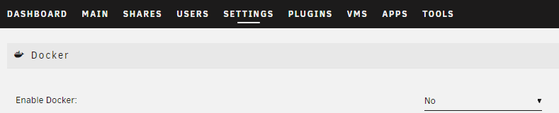
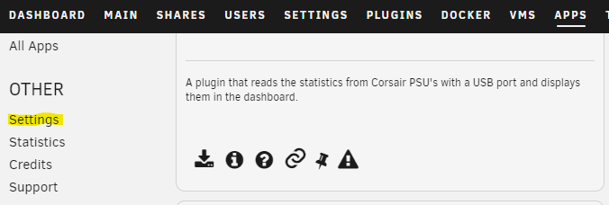
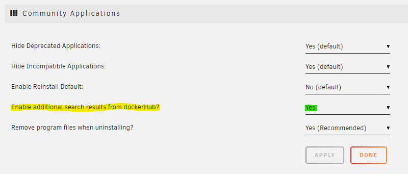
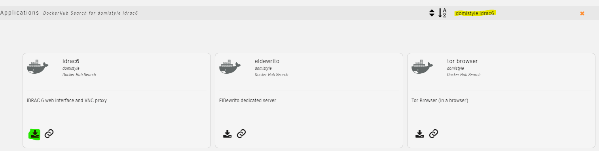
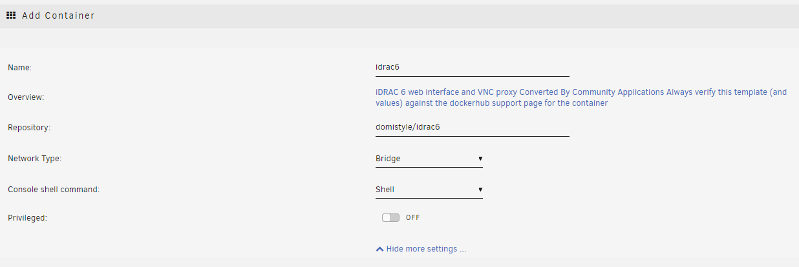
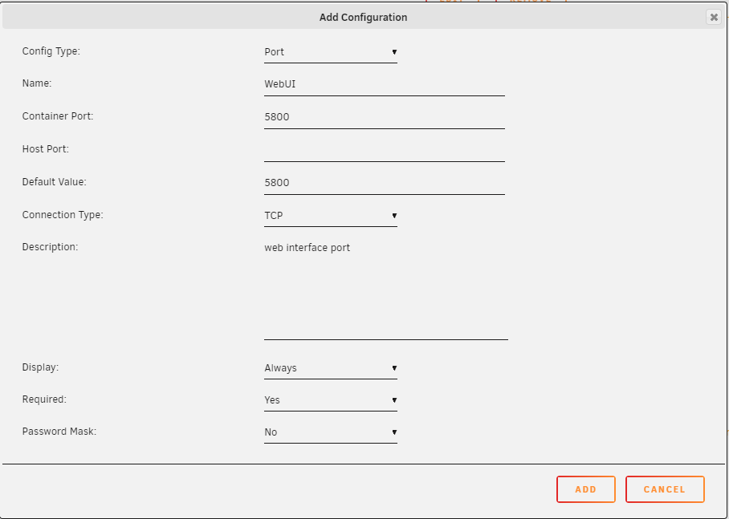
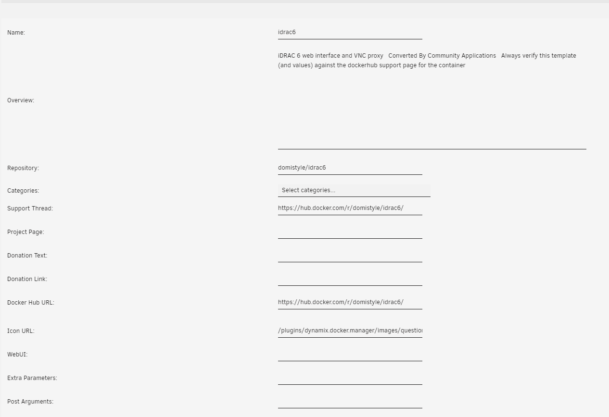
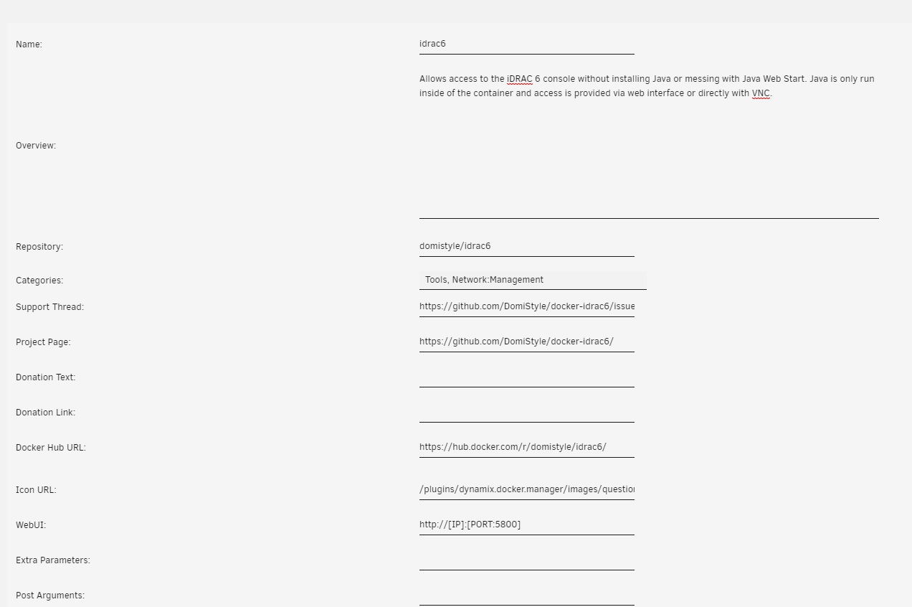
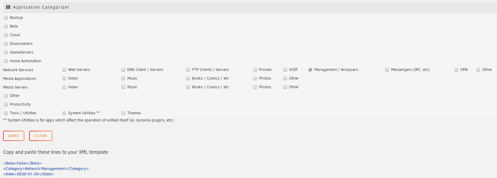

# Writing a template compatible for unraid

This is an effort to collect information from [Squids FAQ](https://forums.unraid.net/topic/57181-docker-faq/){target=_blank}.

## 0. Enabling Template Authoring Mode

In order to have a smooth experience creating templates I highly recommend enabling `Template Authoring Mode`, it allows you to see the XML in clear-text and some other small neat tricks we might need to come back to.

This process requires you to shutdown the docker service for a short while, as unraid doesn't let us change the setting with the service running.  


When the docker service is successfully shutdown, enable advanced view.


We can now enable authoring mode, you can also toggle the docker service back on.  


## 1. Choosing which way to go

We can get started writing templates in two ways:

1. Convert a template generated by Community Application, the CA way
2. Work directly with the XML

## The CA way

### 1.1.0 Enabling search from dockerHub

In order to have Community Applications (hereby referenced as CA) generate a template, we need to enable additional search from dockerHub. You do this by opening CA, and press the settings button on the sidebar.


Enable additional search.


### 1.1.1 Search from DockerHub

For this guide I will use `domistyle/idrac6` as an example. Go back to CA, and type the image you want to create a template for, in the search bar (If you get a match now, chances are, it is already in CA), and press `Get More Results From DockerHub`.


CA shows results for both the image-maintainer, and image-name. Which means that we will get similar results. Press the download to disk icon, and let CA convert it.


For this one CA didn't do a very good job in converting it (it reads the Dockerfile for volumes, expose, publish etc.), however we can modify it with the template editor in Unraid.


### 1.1.2 Editing the template

To see what we need to edit, we can most often refer to the [readme](https://github.com/DomiStyle/docker-idrac6/blob/master/README.md#usage) of the container (including a screenshot incase the readme changes)
.

!!! note "Get to know the template editor, its very handy. Also for managing existing templates."

I'm going through the rest of this guide with a mix of views (to remove clutter from images). If some of the settings you see on a screenshot isn't showing to you, enable advanced view.


#### Variables

I will start with adding the variables, just because those are on the top of the documentation of this container.

To add the `IDRAC_HOST` variable, we are going to press the `Add annother Path, Port, Variable or Device` link.


We need to change the Config Type to Variable, then we can start adding values. There is a lot going on here, but it is all going to make sense in the end.

* ==Name== The name for the variable, this is to help the user identifying what this variable does.

* ==Key== This is the actual variable, so we are putting `IDRAC_HOST` here.  

* ==Value== We don't fill this, this is for the user.  

* ==Default Value== We could fill this, but since we can only do a estimated guess on what a users idrac host is, we are going to skip it.  

* ==Description== Usually I don't fill this field with this long of a text, but the documentation of the container had a good one, so I'm using it.  

* ==Display== This decides if the "average user" (someone that isn't using advanced view) is going to see this variable.  

* ==Required== I set this to yes because I know the container wont work without it set. The fact that the documentation tells me its required also helped in the decision.  

* ==Password Mask== This isn't a password, so it doesn't need to have its value masked behind asterisk (*).  


??? example "Here is some screenshots on how I added the other required variables"

    
    Here I set the Default value as root, since I know that's the default username on idrac  

    
    Here I set the Default value as calvin, since I know that's the default password on idrac, I also enabled Password Mask

#### Volumes

Next is adding the volumes. We press the same `Add annother Path, Port, Variable or Device` link, but we don't need to change the config type this time.
The fields we can add here is mostly the same, but with the "Volume" type some of them are voided. Like password mask.

If it's a "proper" appdata location, I set required to yes

* ==Access Mode== Defines how the container should have access to this volume. Almost always `read/write`


#### Ports

Now its time for the ports. We press the same `Add annother Path, Port, Variable or Device` link. This time we need to change the config type to `Port`.

The documentation for this container says we can use port 5800 to access the interface, so that's the port we are going to add. ~~It also mentions the VNC port, but most users wont need this~~

* ==Connection Type== Always `TCP`, unless specified otherwise.



#### Metadata

Now you have a basic template. This might be enough for your own usage, but in order to add it to CA we should add some spice to the template.

As you can see there is lots of fields we can fill in with the template editor.


I'm not going to walk you trough this, but I am going to tell you how it ended up like it did.

I changed the overview to match the intro from the readme of the container.

I used the dropdown to set the categories as I saw fit.

I set the support thread as the issue page of the project.

!!! danger "Do not do this if you are creating a template for your own container, create a support thread on the unraid forums and use that link"

The project page is usually the GitHub link to the container.

I have yet to change the Icon URL, because I need to create a icon.

`WebUI` Should be filled with the *container* port, unraid should do the translation `http://[IP]:[PORT:5800]`. If this is a https enabled port, set the url to use https.

For Post arguments and Extra Parameters, you should know if you need to fill this.

!!! note "There is more information on these in the [Manual way](#121-fill-the-base)"



### 1.1.3 Grab the XML

Once you have filled all the fields, and set the ports, variables and volumes as good as you can, you can press the `Save` button, this takes you to a page where can see the xml in plain-text. Don't worry, it also saves the xml to your OS disk. Bellow is the XML generated by the procedure above.

??? example "Extracted XML"

    ```xml
    <?xml version="1.0"?>
    <Container version="2">
        <Name>idrac6</Name>
        <Repository>domistyle/idrac6</Repository>
        <Registry>https://hub.docker.com/r/domistyle/idrac6/</Registry>
        <Network>bridge</Network>
        <MyIP/>
        <Shell>sh</Shell>
        <Privileged>false</Privileged>
        <Support>https://github.com/DomiStyle/docker-idrac6/issues</Support>
        <Project>https://github.com/DomiStyle/docker-idrac6/</Project>
        <Overview>Allows access to the iDRAC 6 console without installing Java or messing with Java Web Start. Java is only run inside of the container and access is provided via web interface or directly with VNC.</Overview>
        <Category>Tools: Network:Management</Category>
        <WebUI>http://[IP]:[PORT:5800]</WebUI>
        <TemplateURL/>
        <Icon>/plugins/dynamix.docker.manager/images/question.png</Icon>
        <ExtraParams/>
        <PostArgs/>
        <CPUset/>
        <DateInstalled>1579532295</DateInstalled>
        <DonateText/>
        <DonateLink/>
        <Description>Allows access to the iDRAC 6 console without installing Java or messing with Java Web Start. Java is only run inside of the container and access is provided via web interface or directly with VNC.</Description>
        <Networking>
            <Mode>bridge</Mode>
            <Publish>
            <Port>
                <HostPort/>
                <ContainerPort>5800</ContainerPort>
                <Protocol>tcp</Protocol>
            </Port>
            </Publish>
        </Networking>
        <Data>
            <Volume>
            <HostDir/>
            <ContainerDir>/vmedia</ContainerDir>
            <Mode>rw</Mode>
            </Volume>
            <Volume>
            <HostDir/>
            <ContainerDir>/app</ContainerDir>
            <Mode>rw</Mode>
            </Volume>
            <Volume>
            <HostDir/>
            <ContainerDir>/screenshots</ContainerDir>
            <Mode>rw</Mode>
            </Volume>
        </Data>
        <Environment>
            <Variable>
            <Value/>
            <Name>IDRAC_HOST</Name>
            <Mode/>
            </Variable>
            <Variable>
            <Value/>
            <Name>IDRAC_USER</Name>
            <Mode/>
            </Variable>
            <Variable>
            <Value/>
            <Name>IDRAC_PASSWORD</Name>
            <Mode/>
            </Variable>
            <Variable>
            <Value/>
            <Name>IDRAC_PORT</Name>
            <Mode/>
            </Variable>
            <Variable>
            <Value>false</Value>
            <Name>IDRAC_KEYCODE_HACK</Name>
            <Mode/>
            </Variable>
            <Variable>
            <Value>99</Value>
            <Name>USER_ID</Name>
            <Mode/>
            </Variable>
            <Variable>
            <Value>100</Value>
            <Name>GROUP_ID</Name>
            <Mode/>
            </Variable>
        </Environment>
        <Labels/>
        <Config Name="idrac host" Target="IDRAC_HOST" Default="" Mode="" Description="Host for your iDRAC instance. Make sure your instance is reachable with https://&amp;lt;IDRAC_HOST&amp;gt;. See IDRAC_PORT for using custom ports. HTTPS is always used." Type="Variable" Display="always" Required="true" Mask="false"/>
        <Config Name="idrac user" Target="IDRAC_USER" Default="root" Mode="" Description="Username for your iDRAC instance." Type="Variable" Display="always" Required="true" Mask="false"/>
        <Config Name="idrac password" Target="IDRAC_PASSWORD" Default="calvin" Mode="" Description="Password for your iDRAC instance." Type="Variable" Display="always" Required="true" Mask="true"/>
        <Config Name="WebUI" Target="5800" Default="5800" Mode="tcp" Description="web interface port" Type="Port" Display="always" Required="true" Mask="false"/>
        <Config Name="idrac port" Target="IDRAC_PORT&#9;" Default="443" Mode="" Description="The optional port for the web interface." Type="Variable" Display="advanced-hide" Required="false" Mask="false"/>
        <Config Name="keyboard fix" Target="IDRAC_KEYCODE_HACK" Default="false|true" Mode="" Description="If you have issues with keyboard input, try setting this to true." Type="Variable" Display="advanced-hide" Required="false" Mask="false">false</Config>
        <Config Name="PUID" Target="USER_ID" Default="" Mode="" Description="PUID" Type="Variable" Display="advanced" Required="false" Mask="false">99</Config>
        <Config Name="PGID" Target="GROUP_ID" Default="" Mode="" Description="PGID" Type="Variable" Display="advanced" Required="false" Mask="false">100</Config>
        <Config Name="Virtual media" Target="/vmedia" Default="/mnt/user/appdata/idrac/vmedia" Mode="rw" Description="Can be used to allow virtual media to be mounted." Type="Path" Display="advanced" Required="false" Mask="false"/>
        <Config Name="Libraries" Target="/app" Default="/mnt/user/appdata/idrac/app" Mode="rw" Description="Libraries downloaded from your iDRAC instance will be stored here. Add a volume to cache those files for a faster container startup." Type="Path" Display="advanced" Required="false" Mask="false"/>
        <Config Name="Screenshots" Target="/screenshots" Default="/mnt/user/appdata/idrac/screenshots" Mode="rw" Description="Container Path: /screenshots" Type="Path" Display="advanced" Required="false" Mask="false"/>
    </Container>
    ```

### 1.1.4 Shave off the XML

CA adds a lot of stuff that is not necessary for a template, but which Unraid uses to actually run and present the container.

My first steps in removing unnecessary tags is to delete tags that are closed without value, like `<MyIP/>`.

??? example "XML after"

    ```xml
    <?xml version="1.0"?>
    <Container version="2">
        <Name>idrac6</Name>
        <Repository>domistyle/idrac6</Repository>
        <Registry>https://hub.docker.com/r/domistyle/idrac6/</Registry>
        <Network>bridge</Network>
        <Shell>sh</Shell>
        <Privileged>false</Privileged>
        <Support>https://github.com/DomiStyle/docker-idrac6/issues</Support>
        <Project>https://github.com/DomiStyle/docker-idrac6/</Project>
        <Overview>Allows access to the iDRAC 6 console without installing Java or messing with Java Web Start. Java is only run inside of the container and access is provided via web interface or directly with VNC.</Overview>
        <Category>Tools: Network:Management</Category>
        <WebUI>http://[IP]:[PORT:5800]</WebUI>
        <Icon>/plugins/dynamix.docker.manager/images/question.png</Icon>
        <DateInstalled>1579532295</DateInstalled>
        <Description>Allows access to the iDRAC 6 console without installing Java or messing with Java Web Start. Java is only run inside of the container and access is provided via web interface or directly with VNC.</Description>
        <Networking>
            <Mode>bridge</Mode>
            <Publish>
            <Port>
                <HostPort/>
                <ContainerPort>5800</ContainerPort>
                <Protocol>tcp</Protocol>
            </Port>
            </Publish>
        </Networking>
        <Data>
            <Volume>
            <HostDir/>
            <ContainerDir>/vmedia</ContainerDir>
            <Mode>rw</Mode>
            </Volume>
            <Volume>
            <HostDir/>
            <ContainerDir>/app</ContainerDir>
            <Mode>rw</Mode>
            </Volume>
            <Volume>
            <HostDir/>
            <ContainerDir>/screenshots</ContainerDir>
            <Mode>rw</Mode>
            </Volume>
        </Data>
        <Environment>
            <Variable>
            <Value/>
            <Name>IDRAC_HOST</Name>
            <Mode/>
            </Variable>
            <Variable>
            <Value/>
            <Name>IDRAC_USER</Name>
            <Mode/>
            </Variable>
            <Variable>
            <Value/>
            <Name>IDRAC_PASSWORD</Name>
            <Mode/>
            </Variable>
            <Variable>
            <Value/>
            <Name>IDRAC_PORT</Name>
            <Mode/>
            </Variable>
            <Variable>
            <Value>false</Value>
            <Name>IDRAC_KEYCODE_HACK</Name>
            <Mode/>
            </Variable>
            <Variable>
            <Value>99</Value>
            <Name>USER_ID</Name>
            <Mode/>
            </Variable>
            <Variable>
            <Value>100</Value>
            <Name>GROUP_ID</Name>
            <Mode/>
            </Variable>
        </Environment>
        <Config Name="idrac host" Target="IDRAC_HOST" Default="" Mode="" Description="Host for your iDRAC instance. Make sure your instance is reachable with https://&amp;lt;IDRAC_HOST&amp;gt;. See IDRAC_PORT for using custom ports. HTTPS is always used." Type="Variable" Display="always" Required="true" Mask="false"/>
        <Config Name="idrac user" Target="IDRAC_USER" Default="root" Mode="" Description="Username for your iDRAC instance." Type="Variable" Display="always" Required="true" Mask="false"/>
        <Config Name="idrac password" Target="IDRAC_PASSWORD" Default="calvin" Mode="" Description="Password for your iDRAC instance." Type="Variable" Display="always" Required="true" Mask="true"/>
        <Config Name="WebUI" Target="5800" Default="5800" Mode="tcp" Description="web interface port" Type="Port" Display="always" Required="true" Mask="false"/>
        <Config Name="idrac port" Target="IDRAC_PORT&#9;" Default="443" Mode="" Description="The optional port for the web interface." Type="Variable" Display="advanced-hide" Required="false" Mask="false"/>
        <Config Name="keyboard fix" Target="IDRAC_KEYCODE_HACK" Default="false|true" Mode="" Description="If you have issues with keyboard input, try setting this to true." Type="Variable" Display="advanced-hide" Required="false" Mask="false">false</Config>
        <Config Name="PUID" Target="USER_ID" Default="" Mode="" Description="PUID" Type="Variable" Display="advanced" Required="false" Mask="false">99</Config>
        <Config Name="PGID" Target="GROUP_ID" Default="" Mode="" Description="PGID" Type="Variable" Display="advanced" Required="false" Mask="false">100</Config>
        <Config Name="Virtual media" Target="/vmedia" Default="/mnt/user/appdata/idrac/vmedia" Mode="rw" Description="Can be used to allow virtual media to be mounted." Type="Path" Display="advanced" Required="false" Mask="false"/>
        <Config Name="Libraries" Target="/app" Default="/mnt/user/appdata/idrac/app" Mode="rw" Description="Libraries downloaded from your iDRAC instance will be stored here. Add a volume to cache those files for a faster container startup." Type="Path" Display="advanced" Required="false" Mask="false"/>
        <Config Name="Screenshots" Target="/screenshots" Default="/mnt/user/appdata/idrac/screenshots" Mode="rw" Description="Container Path: /screenshots" Type="Path" Display="advanced" Required="false" Mask="false"/>
    </Container>
    ```

Since I prefer using just the `Config` tags, I also remove the tags `Networking`, `Data` and `Enviroment` together with it's content.

??? example "XML after"

    ```xml
    <?xml version="1.0"?>
    <Container version="2">
        <Name>idrac6</Name>
        <Repository>domistyle/idrac6</Repository>
        <Registry>https://hub.docker.com/r/domistyle/idrac6/</Registry>
        <Network>bridge</Network>
        <Shell>sh</Shell>
        <Privileged>false</Privileged>
        <Support>https://github.com/DomiStyle/docker-idrac6/issues</Support>
        <Project>https://github.com/DomiStyle/docker-idrac6/</Project>
        <Overview>Allows access to the iDRAC 6 console without installing Java or messing with Java Web Start. Java is only run inside of the container and access is provided via web interface or directly with VNC.</Overview>
        <Category>Tools: Network:Management</Category>
        <WebUI>http://[IP]:[PORT:5800]</WebUI>
        <Icon>/plugins/dynamix.docker.manager/images/question.png</Icon>
        <DateInstalled>1579532295</DateInstalled>
        <Description>Allows access to the iDRAC 6 console without installing Java or messing with Java Web Start. Java is only run inside of the container and access is provided via web interface or directly with VNC.</Description>
        <Config Name="idrac host" Target="IDRAC_HOST" Default="" Mode="" Description="Host for your iDRAC instance. Make sure your instance is reachable with https://&amp;lt;IDRAC_HOST&amp;gt;. See IDRAC_PORT for using custom ports. HTTPS is always used." Type="Variable" Display="always" Required="true" Mask="false"/>
        <Config Name="idrac user" Target="IDRAC_USER" Default="root" Mode="" Description="Username for your iDRAC instance." Type="Variable" Display="always" Required="true" Mask="false"/>
        <Config Name="idrac password" Target="IDRAC_PASSWORD" Default="calvin" Mode="" Description="Password for your iDRAC instance." Type="Variable" Display="always" Required="true" Mask="true"/>
        <Config Name="WebUI" Target="5800" Default="5800" Mode="tcp" Description="web interface port" Type="Port" Display="always" Required="true" Mask="false"/>
        <Config Name="idrac port" Target="IDRAC_PORT&#9;" Default="443" Mode="" Description="The optional port for the web interface." Type="Variable" Display="advanced-hide" Required="false" Mask="false"/>
        <Config Name="keyboard fix" Target="IDRAC_KEYCODE_HACK" Default="false|true" Mode="" Description="If you have issues with keyboard input, try setting this to true." Type="Variable" Display="advanced-hide" Required="false" Mask="false">false</Config>
        <Config Name="PUID" Target="USER_ID" Default="" Mode="" Description="PUID" Type="Variable" Display="advanced" Required="false" Mask="false">99</Config>
        <Config Name="PGID" Target="GROUP_ID" Default="" Mode="" Description="PGID" Type="Variable" Display="advanced" Required="false" Mask="false">100</Config>
        <Config Name="Virtual media" Target="/vmedia" Default="/mnt/user/appdata/idrac/vmedia" Mode="rw" Description="Can be used to allow virtual media to be mounted." Type="Path" Display="advanced" Required="false" Mask="false"/>
        <Config Name="Libraries" Target="/app" Default="/mnt/user/appdata/idrac/app" Mode="rw" Description="Libraries downloaded from your iDRAC instance will be stored here. Add a volume to cache those files for a faster container startup." Type="Path" Display="advanced" Required="false" Mask="false"/>
        <Config Name="Screenshots" Target="/screenshots" Default="/mnt/user/appdata/idrac/screenshots" Mode="rw" Description="Container Path: /screenshots" Type="Path" Display="advanced" Required="false" Mask="false"/>
    </Container>
    ```

Remove `DateInstalled`, since it's just used internally for Unraid. Unless you know what shell the container uses, also remove `Shell`.

??? example "What I consider a good XML, to base a PR on"

    ```xml
    <?xml version="1.0"?>
    <Container version="2">
        <Name>idrac6</Name>
        <Repository>domistyle/idrac6</Repository>
        <Registry>https://hub.docker.com/r/domistyle/idrac6/</Registry>
        <Network>bridge</Network>
        <Privileged>false</Privileged>
        <Support>https://github.com/DomiStyle/docker-idrac6/issues</Support>
        <Project>https://github.com/DomiStyle/docker-idrac6/</Project>
        <Overview>Allows access to the iDRAC 6 console without installing Java or messing with Java Web Start. Java is only run inside of the container and access is provided via web interface or directly with VNC.</Overview>
        <Category>Tools: Network:Management</Category>
        <WebUI>http://[IP]:[PORT:5800]</WebUI>
        <Icon>/plugins/dynamix.docker.manager/images/question.png</Icon>
        <Description>Allows access to the iDRAC 6 console without installing Java or messing with Java Web Start. Java is only run inside of the container and access is provided via web interface or directly with VNC.</Description>
        <Config Name="idrac host" Target="IDRAC_HOST" Default="" Mode="" Description="Host for your iDRAC instance. Make sure your instance is reachable with https://&amp;lt;IDRAC_HOST&amp;gt;. See IDRAC_PORT for using custom ports. HTTPS is always used." Type="Variable" Display="always" Required="true" Mask="false"/>
        <Config Name="idrac user" Target="IDRAC_USER" Default="root" Mode="" Description="Username for your iDRAC instance." Type="Variable" Display="always" Required="true" Mask="false"/>
        <Config Name="idrac password" Target="IDRAC_PASSWORD" Default="calvin" Mode="" Description="Password for your iDRAC instance." Type="Variable" Display="always" Required="true" Mask="true"/>
        <Config Name="WebUI" Target="5800" Default="5800" Mode="tcp" Description="web interface port" Type="Port" Display="always" Required="true" Mask="false"/>
        <Config Name="idrac port" Target="IDRAC_PORT&#9;" Default="443" Mode="" Description="The optional port for the web interface." Type="Variable" Display="advanced-hide" Required="false" Mask="false"/>
        <Config Name="keyboard fix" Target="IDRAC_KEYCODE_HACK" Default="false|true" Mode="" Description="If you have issues with keyboard input, try setting this to true." Type="Variable" Display="advanced-hide" Required="false" Mask="false">false</Config>
        <Config Name="PUID" Target="USER_ID" Default="" Mode="" Description="PUID" Type="Variable" Display="advanced" Required="false" Mask="false">99</Config>
        <Config Name="PGID" Target="GROUP_ID" Default="" Mode="" Description="PGID" Type="Variable" Display="advanced" Required="false" Mask="false">100</Config>
        <Config Name="Virtual media" Target="/vmedia" Default="/mnt/user/appdata/idrac/vmedia" Mode="rw" Description="Can be used to allow virtual media to be mounted." Type="Path" Display="advanced" Required="false" Mask="false"/>
        <Config Name="Libraries" Target="/app" Default="/mnt/user/appdata/idrac/app" Mode="rw" Description="Libraries downloaded from your iDRAC instance will be stored here. Add a volume to cache those files for a faster container startup." Type="Path" Display="advanced" Required="false" Mask="false"/>
        <Config Name="Screenshots" Target="/screenshots" Default="/mnt/user/appdata/idrac/screenshots" Mode="rw" Description="Container Path: /screenshots" Type="Path" Display="advanced" Required="false" Mask="false"/>
    </Container>
    ```

!!! note "More spice"
    It's worth reading [1.1.2 Add a Config](#122-add-a-config) and [Tips and tricks](#2-additional-tags-and-neat-tricks) to see if any of that applies to your template.

## The Manual way

### 1.2.0 Starting from "scratch"

To make sure we don't miss anything, we are going to start from a baseXML.

I'm using the same [example-container](https://hub.docker.com/r/domistyle/idrac6/){target=_blank} as above.

!!! note "Knowing the basics of [XML](https://www.w3schools.com/xml/default.asp){target=_blank} is preferred"

??? example "baseXML"

    ```xml
    <?xml version="1.0"?>
        <Container version="2">
        <Name></Name>
        <Repository></Repository>
        <Registry></Registry>
        <Network>bridge</Network>
        <Privileged>false</Privileged>
        <Support></Support>
        <Project></Project>
        <Overview></Overview>
        <WebUI></WebUI>
        <TemplateURL/>
        <Icon>/plugins/dynamix.docker.manager/images/question.png</Icon>
        <ExtraParams/>
        <PostArgs/>
        <DonateText/>
        <DonateLink/>
    </Container>
    ```

### 1.2.1 Fill the base

Since you are here browsing the "hard" way, I'm assuming you know some, if not most of the Docker terminology used going forward.

Filling the baseXML above is pretty straight forward, however the tags expect the following:

* ==Name== The name for the container, preferably in lowercase.

* ==Repository== The name of the image to pull from dockerHub (other repositories work). e.g. `domistyle/idrac6`

* ==Registry== Link to the dockerHub page for this container. e.g. `https://hub.docker.com/r/domistyle/idrac6/`

* ==Support== A link to a support thread on the unraid forums for the container

* ==Project== Link to the GitHub page (or the homepage of the project) e.g. `https://github.com/DomiStyle/docker-idrac6/`

* ==Overview== Basic description of the project. e.g.
  > Allows access to the iDRAC 6 console without installing Java or messing with Java Web Start. Java is only run inside of the container and access is provided via web interface or directly with VNC.

* ==WebUI== Which container-port an eventual webui might be. e.g. `http://[IP]:[PORT:5800]` Unraid will translate this string to the IP of the server, and the host-port set for container-port 5800

* ==Icon== URL to a icon, personally I prefer them in png. Has to be loaded over https. e.g. `https://raw.githubusercontent.com/selfhosters/unRAID-CA-templates/master/templates/img/chevereto.png`
{: style="height:1em"}

* ==ExtraParams== Parameters sent with the `docker run` command. e.g. `--restart unless-stopped`

* ==PostArgs== Command to run inside the container after start. e.g. `/bin/sh -c 'apk update && apk add ipmitool && telegraf'`  
[See valid example](../../telegraf/ipmi#telegraf){target=_blank}

* ==DonateText== Text to show with the donate button.

* ==DonateLink== URL for donations.

* ==Network== Usually `bridge` if not specified by the image maintainer

* ==TemplateURL== Url to the template. If it is a PR to our repo, set it to `https://raw.githubusercontent.com/selfhosters/unRAID-CA-templates/master/templates/<container-name>.xml` and replace `<container-name>` with the actual name of the container (again, in lowercase).

!!! warning
    Has to be a raw link for GitHub.

* ==DonateImg== URL to donation image.

### 1.2.2 Add a Config

There is two ways to achieve this, but I'm only going to focus on one of them.
The syntax is like this:

```xml
<Config Name="" Target="" Default="" Mode="rw" Description="" Type="Path" Display="always" Required="false" Mask="false"/>
```

This syntax spans over all the 4 config types, some attributes changes meaning depending on the `Type`.

#### Add a Volume

The volume specific values are:

* ==Target== The container path for the volume. e.g. `/config`

* ==Mode== What permissions to use for the volume.
    * `rw` as ReadWrite
    * `ro` as ReadOnly
    * Slave options are also supported

* ==Type== Always `Path`.

#### Add a Variable

* ==Target== The variable. e.g. `IDRAC_HOST`

* ==Type== Always `Variable`.

#### Add a Port

* ==Target== The container port. e.g. `80`

* ==Type== Always `Port`.

#### Shared attributes

* ==Name== The name that shows in the Unraid template manager. e.g. `Appdata`, `PUID`, `WebUI`

* ==Description== A more detailed description on this Config. e.g `Appdata location`, `PUID`, `WebUI`

* ==Default== Suggested value for the Config. e.g. `/mnt/user/appdata/idrac`, `99`, `8080`

* ==Display== How the volume is shown to the user.
    * `always` Always show the volume, can be edited and deleted in basic view.
    * `always-hide`  Always show the volume, can *not* be edited and deleted in basic view.
    * `advanced` Shows when the user presses `Show more settings ...`, can be edited and deleted in basic view.
    * `advanced-hide` Shows when the user presses `Show more settings ...`, can *not* be edited and deleted in basic view.

* ==Required== If the user is able to continue without specifying the value. `true` or `false`

* ==Mask== If the value should be masked behind asterisk, only really useful on variables. `true` or `false`

### 2 Additional tags, and neat tricks

CA supports some extra tags that enhances the experience. They are all listed in the [XML schema post](https://forums.unraid.net/topic/38619-docker-template-xml-schema/){target=_blank}.

* ==Beta== Gives the application a warning in CA with the following text `This application has been marked as being Beta.  This does NOT neccessarily mean that there will be issues.`. `<Beta>true</Beta>` or `<Beta>false</Beta>`

* ==Branch== Prompts the user to choose a dockerHub tag. e.g. [linuxserver/emby.xml](https://github.com/linuxserver/docker-templates/blob/7e87d46ca1edcb0371b5f5f3a663735242d042ce/linuxserver.io/emby.xml#L6-L13){target=_blank}

The template manager also support setting a set of predefined values, often uses in conjunction with variables that expect bools. Defined by separating the values with `|`. e.g. `true|false`. Has to be set in the default attribute.

#### 2.1 Categories

It's preferred to categories your template, use the `Application Categorizer` plugin in CA to do this, it generates the tags we need for us.

