# Advanced Tailscale Settings

## Log in to Tailscale Settings

1. Log in to the Unraid server and switch to the **Settings** tab.
2. Click on **Tailscale**.

    

3. On the **Tailscale** tab, click the **Viewing** button.

    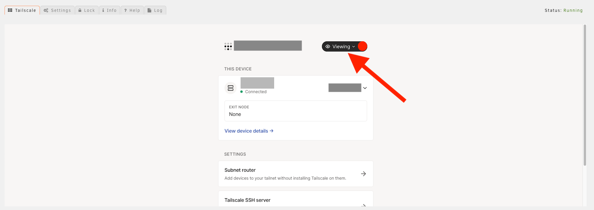

4. Click **Sign in to confirm identity**

    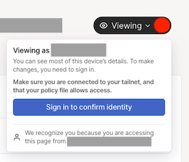

5. A new window will open. Click **Viewing** in this window, then **Sign in to confirm identity**.
6. Log in to Tailscale. Click **Close window** to return to the Tailscale settings once you have logged in.

## Subnet Router

1. Click **Subnet router**.

    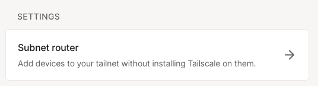

2. Enter the desired routes and click **Advertise routes**.

    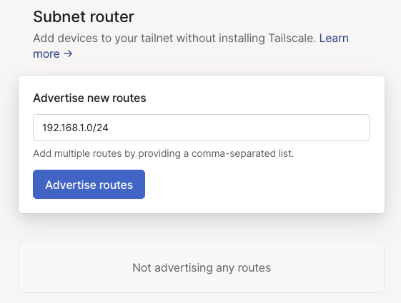

3. The routes will be displayed with a **Pending approval** message. The routes must be approved in the Tailscale
    admin console before they can be used.

    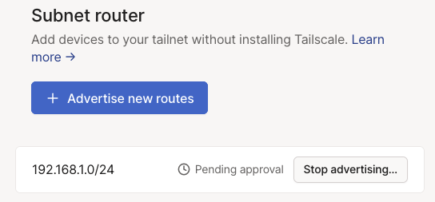

4. Open the [Tailscale admin console](https://login.tailscale.com/admin/machines).
5. Locate the server in the machine list. It will have a blue **Subnets** badge with an exclamation point indicating
    that the server has routes that have not yet been approved.

    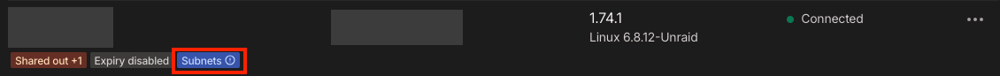

6. Click the three dots at the end of the row, then **Edit route settings...**.

    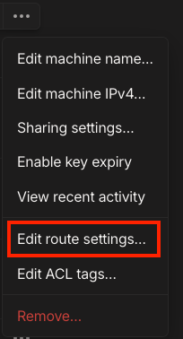

7. Check the routes to approve and save.

    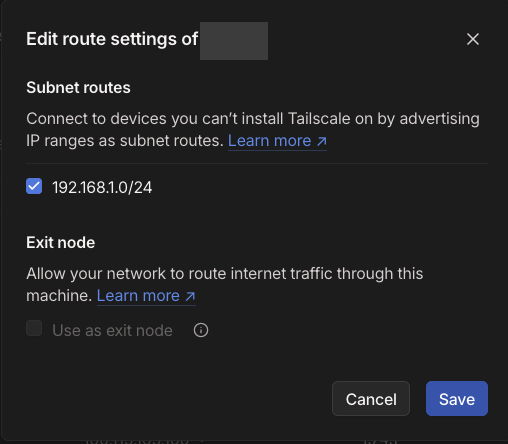

## Exit Node

1. Click the down arrow under **EXIT NODE**.
2. Select **Run as exit node**.

    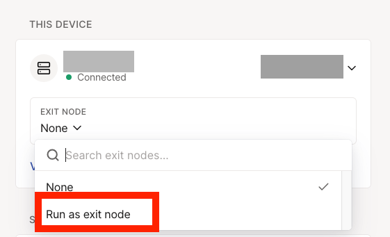

3. The server will now advertise itself as an exit node. This must be approved in the Tailscale admin console before
    it can be used.

    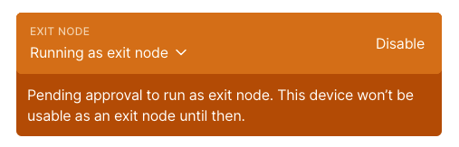

4. Open the [Tailscale admin console](https://login.tailscale.com/admin/machines).
5. Locate the server in the machine list. It will have a blue **Exit Node** badge with an exclamation point indicating
    that the server has not yet been approved as an exit node.

    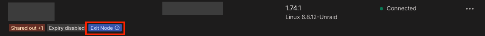

6. Click the three dots at the end of the row, then **Edit route settings...**.

    

7. Check **Use as exit node** and save.

    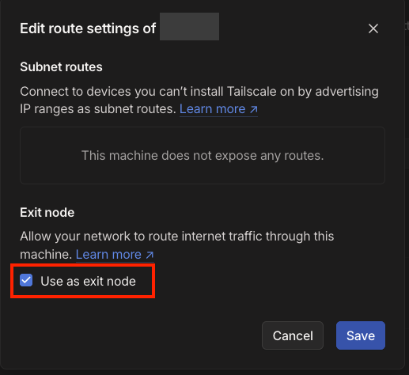
