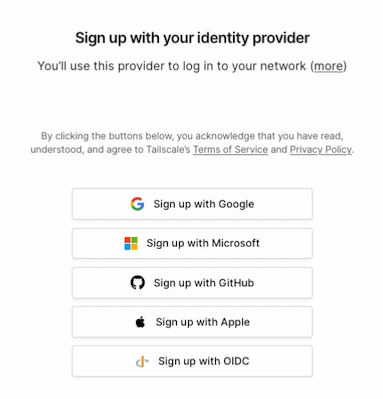
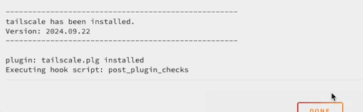
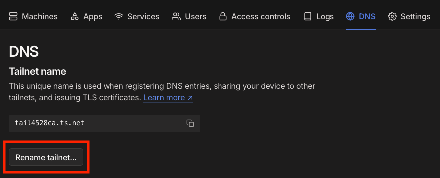

# Basic Tailscale Setup

These instructions will help you create a Tailnet and connect an Unraid server. Once finished, you should be able to
connect to the following services via the Tailscale IP / MagicDNS name of the Unraid server:

- WebGUI
- File shares (SMB/NFS)
- SSH
- Bridge mode Docker containers (default or custom bridge networks)

!!! note
    Docker containers running on ipvlan/macvlan networks (e.g., br0) cannot be accessed via the Tailscale IP for the
    Unraid server. To connect to these containers, you should either [configure a subnet router](advanced.md) or
    [add Tailscale to the container](docker.md).

## Create a Tailnet

1. Go to [Tailscale](https://www.tailscale.com) and click the **Get Started** button.

    

2. Select an identity provider and log in.

    

3. Select either **Business use** or **Personal use**.

    

4. Follow the provided instructions to install Tailscale on a client device (phone/laptop/etc.).

    

5. Once you have installed Tailscale on the device, it will appear on the screen.

    

## Install the Unraid Tailscale Plugin

1. Log in to the Unraid server and switch to the **Apps** tab.
2. Search for **Tailscale**.
3. Install **Tailscale (Plugin)**.

    

4. Click **Done** once the window shows that Tailscale has been installed.

    

5. Switch to the **Settings** tab, then click on **Tailscale**.

    

6. Click **Reauthenticate**.

    

7. Click **Connect**.

    

8. After the connection is complete, the browser will redirect to the Tailscale admin console, which should show both
    devices are connected.

    

## Finish Tailscale Setup

1. Open the [Tailscale DNS Settings](https://login.tailscale.com/admin/dns).

2. (Optional) Click **Rename tailnet...** . This will allow you to select a more friendly .ts.net domain name for your
    devices.

    

3. At the bottom of the DNS page, click **Enable HTTPS**. This will allow Tailscale to generate SSL certificates for
    your devices (e.g., to avoid certificate warnings when accessing the Unraid WebGUI.)

    !!! note
        Machine names are published in a public certificate ledger when HTTPS is enabled. The public ledger only provides
        information about the names of the TLS certificates; access to your devices is still restricted by Tailscale.

        For more information, see the [Tailscale HTTPS documentation](https://tailscale.com/kb/1153/enabling-https#machine-names-in-the-public-ledger).

    
