# Directly Connecting Containers to Tailscale

!!! info
    Docker containers running on bridge networks do not need to have Tailscale installed within the container if the
    Tailscale plugin is installed. Bridge containers will automatically work on the Unraid server's Tailscale IP.

    Installing Tailscale directly on a container is useful in other scenarios:

    - Containers running on ipvlan/macvlan networks (e.g. br0)
    - Sharing a specific container via Tailscale.

## Methods

Several options are available to connect a container directly to Tailscale:

- Using the Tailscale Docker Mod for LinuxServer.io containers
- Running Tailscale as a sidecar container

### Using the Tailscale Docker Mod for LinuxServer.io containers

1. Edit the Docker container that you wish to connect to Tailscale.

    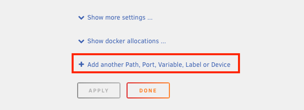

2. Add a variable:

    - Name: **DOCKER_MODS**
    - Key: **DOCKER_MODS**
    - Value: `ghcr.io/tailscale-dev/docker-mod:main`

    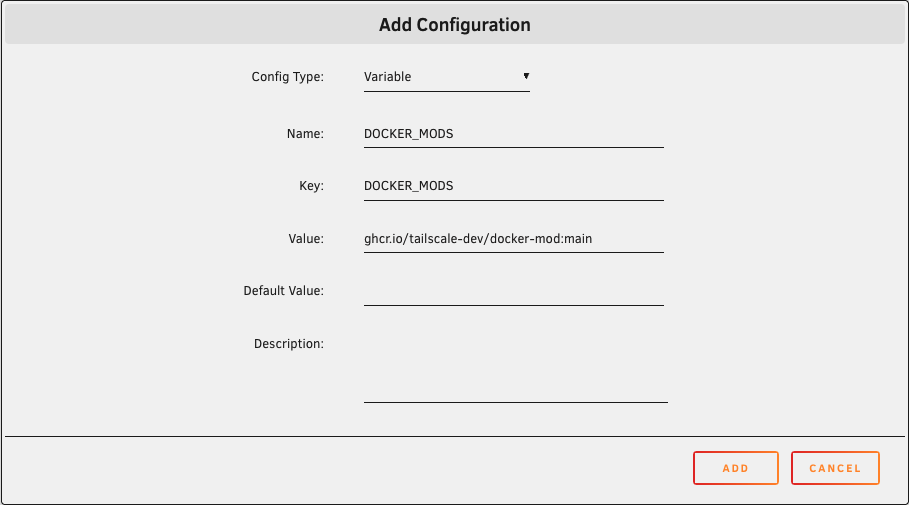

3. Add a variable:

    - Name: **TAILSCALE_STATE_DIR**
    - Key: **TAILSCALE_STATE_DIR**
    - Value: `/var/lib/tailscale`

    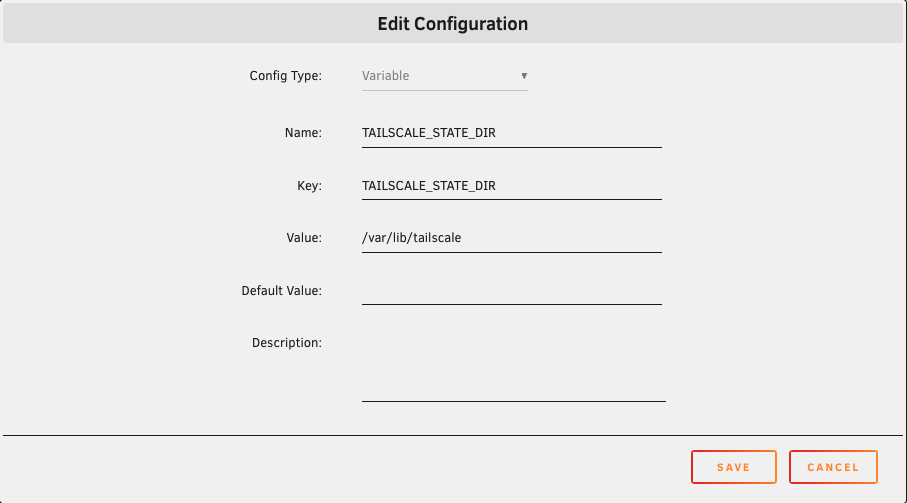

4. Add a path:

    - Name: **TS_STATE_PATH**
    - Container Path: `/var/lib/tailscale`
    - Host Path: A unique name to create a Docker volume for the Tailscale state.

    !!! note
        You can also use a filesystem path to create a bind mount instead of a Docker volume.

    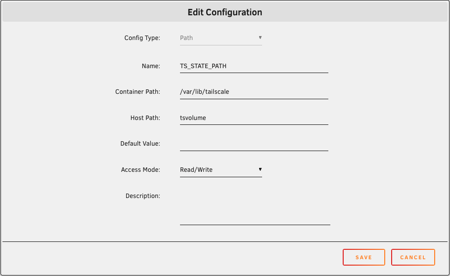

5. Apply the changes to the container.

    !!! warning
        If the Tailscale state variable or path are not configured, Tailscale will be logged out any time the container
        restarts.

    !!! tip
        If you would like to have Tailscale automatically log in instead of using the logs to get a login link, you can
        create an auth key from the Tailscale admin console and add another variable named `TAILSCALE_AUTHKEY`
        containing the key.

6. Open the logs for the container. Locate the line that says **AuthURL is**. Click the link to log in to Tailscale.

    

!!! tip
    The docker mod can be customized further using variables (e.g., to enable Tailscale serve). Refer to the
    [mod documentation](https://github.com/tailscale-dev/docker-mod/pkgs/container/docker-mod) for the complete list
    of variables.

### Running Tailscale as a sidecar container

1. Install **Tailscale-Docker** from Community Applications.

    !!! tip
        You can create an auth key from the Tailscale admin console and add that as the **Authentication Key** in the
        container settings. If you do not use an auth key, you will need to open the logs after starting the container
        to get the login link.

    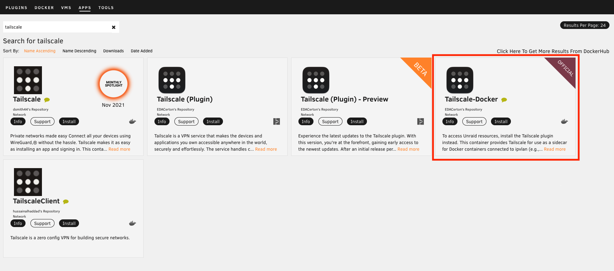

2. If you did not use an authentication key, open the logs for the created container and use the link to log in.

    !!! warning
        The container will automatically stop after 60 seconds if the login has not been completed. If using the login
        link to authenticate, you should start the container, then immediately open the logs and log in to Tailscale.

    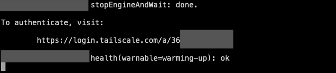

3. Edit the container that you wish to connect to Tailscale:

    ??? info "Alternate instructions for Unraid 7.0 beta 2 and earlier"
        The option to connect container networks was added after Unraid 7 beta 2. On earlier versions of Unraid, you can
        manually configure the connection:

        - **Network Type**: **None**
        - **Extra Parameters**: `--net=container:CONTAINERNAME`

    - **Network Type**: **Container**
    - **Container Network**: The Tailscale container

    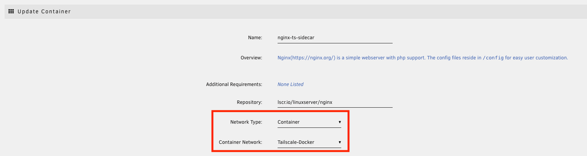

    ??? note "Published ports"
        When a container is connected directly to Tailscale, the container ports are used, not the published ports.

        For example, for a container with these ports:

        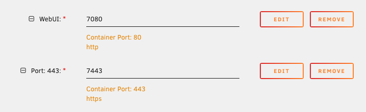

        The service would become available on **http://server.tailnet.ts.net/** (using port 80) and
        **https://server.tailnet.ts.net/** (using port 443). Ports 7080 and 7443 are not used.

        If you wish to publish ports on a local address in addition to the Tailscale address, you must add the ports
        to the settings for the Tailscale container.

        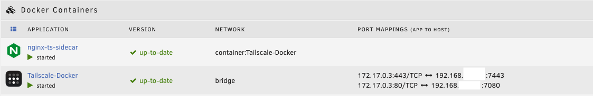

#### Enable Kernel Networking

!!! info
    Userspace networking (the default) is fine for most scenarios (e.g., allowing container to be accessed via
    Tailscale).

    Enabling kernel networking may be required in scenarios where the container must be able to make MagicDNS
    queries or initiate connections to other Tailscale devices, for example:

     - A backup container that either ***pulls data from*** or ***pushes data to*** another system via Tailscale.
       (Backup containers where clients push data to the container via Tailscale do not require kernel networking.)
     - A monitoring container that connects to other systems via Tailscale to monitor system status (e.g., Uptime Kuma)

1. Edit the Tailscale container.
2. Set **Privileged** to **On**.

    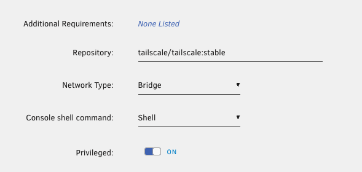

3. Expand the settings, then set **TS_USERSPACE** to `false`.

    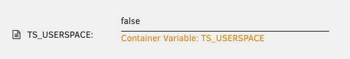

4. Add a device:

    - **Name**: `/dev/net/tun`
    - **Value**: `/dev/net/tun`

    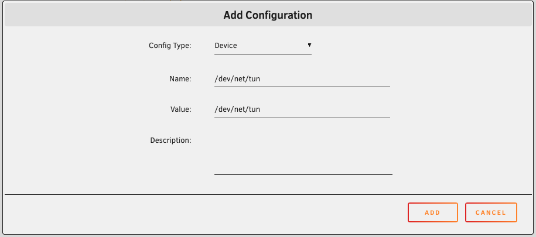

5. Apply the changes.
