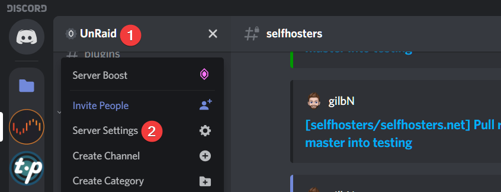
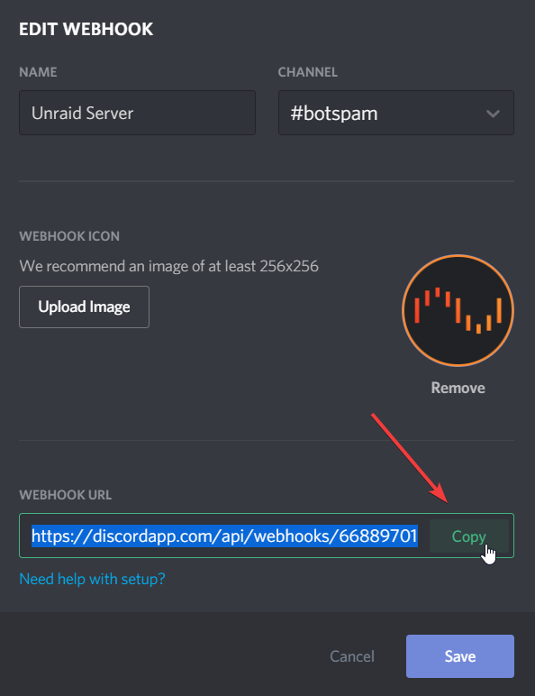
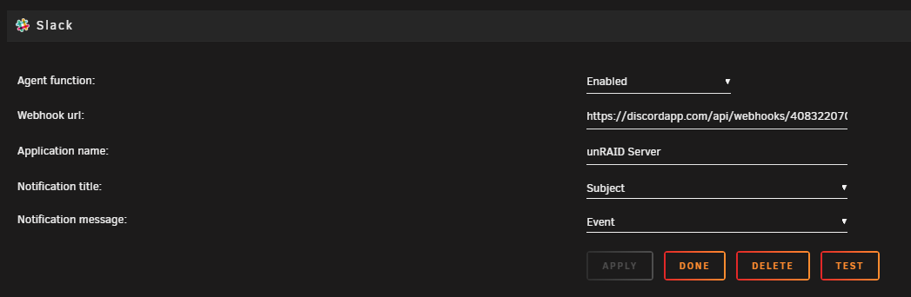

# Discord Notifications

## Creating the Discord webhook

1. Head over to your Discord server and  click on ==Server Settings== then ==Webhooks== and ==Create Webhooks== Give it a name and choose the channel you want it to send notifications to.

2. Copy the Webhook URL and click save.

## Adding the webhook

As Unraid doesn't officially support Discord notifications we have to use the Slack agent.

1. Go to the Unraid settings page and click on ==Notifications==
Make sure that system notifications are enabled and select the different types of notifications you want in the ==Agents== list.

2. Scroll down to the Slack agent, enable the agent, paste your webhook URL and give it a name. (The name you add here will override the name you gave it in the Discord settings)
At the end of your webhook URL add ==/slack== so the URL looks like this: `https://discordapp.com/api/webhooks/40832456738934/7DcEpWr5V24OIEIELjg-KkHky86SrOgTqA/slack`
3. To test the connection you can just click the Test button.

!!! note "Note"
    There are some limitations on what the different notifications titles and messages can be.
    I have found that notifications title `Subject` and notifications message `Event` works just fine. If you add any more it will probably not send any notifications.

